# Human Manual

## What This Pack Helps With

make qwen-code safer to evaluate through host instructions, coding-agent boundaries, eval prompts, and recovery checks for terminal workflow failures

## How To Use

1. Read `README.md`.
2. Load `AGENTS.md` or `CLAUDE.md`.
3. Run evals.
4. Use pitfall and risk files to recover from failure.

## What This Pack Does Not Do

- It does not replace upstream docs.
- It does not prove production readiness.
- It does not claim official endorsement.

## Doramagic Source Extract

# https://github.com/QwenLM/qwen-code 项目说明书

生成时间：2026-05-14 05:02:28 UTC

## 目录

- [项目概览](#project-overview)
- [快速入门](#quick-start)
- [系统架构](#system-architecture)
- [包结构详解](#packages-structure)
- [智能体运行时](#agent-runtime)
- [工具系统](#tool-system)
- [模型集成](#model-integration)
- [记忆系统](#memory-system)
- [会话管理](#session-management)
- [技能与钩子系统](#skills-hooks)

<a id='project-overview'></a>

## 项目概览

### 相关页面

相关主题：[系统架构](#system-architecture), [快速入门](#quick-start)

<details>
<summary>相关源码文件</summary>

以下源码文件用于生成本页说明：

- [README.md](https://github.com/QwenLM/qwen-code/blob/main/README.md)
- [packages/webui/README.md](https://github.com/QwenLM/qwen-code/blob/main/packages/webui/README.md)
- [docs-site/README.md](https://github.com/QwenLM/qwen-code/blob/main/docs-site/README.md)
- [packages/cli/src/ui/components/arena/ArenaSelectDialog.tsx](https://github.com/QwenLM/qwen-code/blob/main/packages/cli/src/ui/components/arena/ArenaSelectDialog.tsx)
- [packages/cli/src/ui/components/subagents/create/CreationSummary.tsx](https://github.com/QwenLM/qwen-code/blob/main/packages/cli/src/ui/components/subagents/create/CreationSummary.tsx)
</details>

# 项目概览

## 简介

Qwen Code 是一个基于大语言模型（LLM）的智能编程助手项目，由 Qwen 团队开发维护。该项目旨在为开发者提供高效的代码编写、理解和编辑能力，支持多种模型提供商和本地部署方案。

Qwen Code 采用模块化架构设计，核心包含命令行界面（CLI）包和 Web UI 组件库两个主要子系统，能够适应不同的使用场景和部署环境。资料来源：[README.md:1-10]()

## 技术架构

### 整体架构图

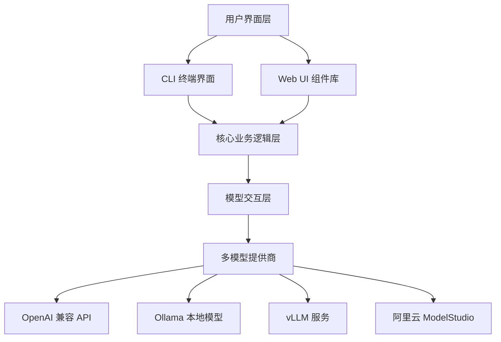

### 核心包结构

| 包名称 | 路径 | 功能描述 |
|--------|------|----------|
| `packages/cli` | `packages/cli/` | 命令行工具核心包，提供终端交互界面 |
| `packages/webui` | `packages/webui/` | Web 界面组件库，包含 UI 基础组件 |
| `docs-site` | `docs-site/` | 文档网站，基于 Next.js 和 Nextra 构建 |

资料来源：[packages/webui/README.md:1-30]()

## CLI 包架构

### 目录结构

```
packages/cli/
├── src/
│   ├── ui/                    # 终端用户界面
│   │   ├── components/         # UI 组件
│   │   │   ├── arena/         # Arena 对比系统
│   │   │   ├── subagents/     # 子代理管理
│   │   │   ├── mcp/           # MCP 协议支持
│   │   │   ├── extensions/    # 扩展系统
│   │   │   ├── background-view/ # 后台任务视图
│   │   │   └── views/         # 通用视图组件
│   │   ├── hooks/             # 自定义 React Hooks
│   │   └── keyMatchers.ts     # 键盘快捷键匹配
│   ├── nonInteractiveCli.ts   # 非交互式 CLI
│   └── ...
```

### UI 组件系统

CLI 包采用 React 组件化设计，所有 UI 组件基于 `ink` 库构建，支持终端环境下的富文本渲染。

**核心组件分类：**

| 组件类别 | 文件路径 | 功能 |
|----------|----------|------|
| Arena 组件 | `ui/components/arena/` | Agent 对比选择、停止对话框、卡片展示 |
| 子代理组件 | `ui/components/subagents/` | 创建、编辑、管理子代理 |
| MCP 组件 | `ui/components/mcp/` | MCP 服务器工具列表和交互 |
| 扩展组件 | `ui/components/extensions/` | 扩展详情展示 |
| 统计组件 | `ui/components/StatsDisplay.tsx` | 性能统计和模型使用情况 |

资料来源：[packages/cli/src/ui/components/arena/ArenaSelectDialog.tsx:1-50]()

### Arena 对比系统

Arena 是 Qwen Code 中的 Agent 对比评估模块，允许用户同时运行多个代理并比较它们的结果。

**Arena 核心功能：**

- **选择对话框** (`ArenaSelectDialog.tsx`)：展示可用代理列表，支持状态筛选
- **停止对话框** (`ArenaStopDialog.tsx`)：提供清理或保留工作树的选项
- **卡片展示** (`ArenaCards.tsx`)：显示对比结果和统计数据

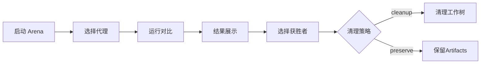

资料来源：[packages/cli/src/ui/components/arena/ArenaStopDialog.tsx:1-60]()

### 子代理系统

子代理（Subagents）允许用户创建自定义的 AI 代理，配置专属的系统提示词、工具集和颜色标识。

**子代理创建流程：**

1. 配置基本信息（名称、描述）
2. 选择可用工具集
3. 设置系统提示词
4. 选择存储位置（项目级或用户级）
5. 保存并激活

```typescript
interface SubagentConfig {
  name: string;
  description: string;
  systemPrompt: string;
  tools: string[];
  color?: string;
  location: 'project' | 'user';
  model?: string;
}
```

资料来源：[packages/cli/src/ui/components/subagents/create/CreationSummary.tsx:1-40]()

### MCP 协议支持

Qwen Code 集成了 MCP（Model Context Protocol）协议，支持通过 MCP 服务器扩展工具能力。

**MCP 功能特性：**

| 功能 | 命令 | 说明 |
|------|------|------|
| 工具列表 | `/mcp` | 显示所有 MCP 工具 |
| 工具详情 | `/mcp schema` | 显示工具参数模式 |
| 隐藏描述 | `/mcp nodesc` | 隐藏工具描述信息 |
| OAuth 认证 | `/mcp auth <server-name>` | MCP 服务器认证 |
| 快捷开关 | `Ctrl+T` | 切换工具描述显示 |

资料来源：[packages/cli/src/ui/components/views/McpStatus.tsx:1-50]()

### 后台任务系统

后台任务视图（BackgroundTasksDialog）提供了长时间运行任务的监控能力。

**任务状态展示：**

- **运行中**：显示进度文本和会话数量
- **已完成**：显示执行时长和主题统计
- **错误状态**：展示错误信息和警告
- **锁释放警告**：提示可能的锁定问题

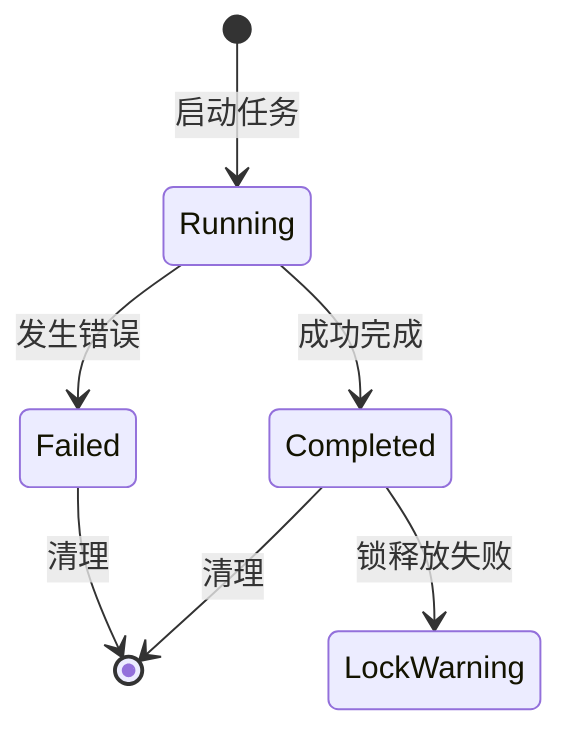

资料来源：[packages/cli/src/ui/components/background-view/BackgroundTasksDialog.tsx:1-80]()

## Web UI 组件库

### 组件分类

| 类别 | 组件列表 | 用途 |
|------|----------|------|
| 图标组件 | FileIcon, FolderIcon, CheckIcon, ErrorIcon | 基础视觉元素 |
| 布局组件 | Container, Header, Footer, Sidebar | 页面结构布局 |
| 消息组件 | Message, MessageList, MessageInput | 对话交互 |
| 工具调用 | ToolCallCard, ToolCallRow | 工具执行展示 |

资料来源：[packages/webui/README.md:50-100]()

### 平台上下文

WebUI 提供 Platform Context 作为平台抽象层，支持不同运行环境的适配：

```tsx
import { PlatformProvider, usePlatform } from '@qwen-code/webui/context';
```

### 主题系统

组件支持自定义主题配置，包括：

- **颜色系统**：主色、强调色、状态色（成功/错误/警告）
- **尺寸变体**：`sm` | `md` | `lg`
- **状态标识**：错误状态、加载状态、空状态

## 文档站点

文档网站采用以下技术栈：

| 技术 | 用途 |
|------|------|
| Next.js | React 框架和路由系统 |
| Nextra | MDX 文档框架 |
| TypeScript | 类型安全 |

**开发命令：**

```bash
npm install    # 安装依赖
npm run link   # 链接 docs 目录内容
npm run dev    # 启动开发服务器
```

资料来源：[docs-site/README.md:1-40]()

## 配置系统

### 模型配置

Qwen Code 支持配置多个模型提供商，通过 `~/.qwen/settings.json` 文件管理：

```json
{
  "modelProviders": {
    "openai": [
      {
        "id": "qwen3:32b",
        "name": "Qwen3 32B (Ollama)",
        "baseUrl": "http://localhost:11434/v1",
        "generationConfig": {
          "contextWindowSize": 131072
        }
      }
    ]
  },
  "model": {
    "name": "qwen3:32b"
  }
}
```

### 键盘快捷键

| 命令 | 快捷键 | 功能 |
|------|--------|------|
| 提交输入 | `Enter` | 发送消息 |
| 取消/返回 | `Escape` | 关闭对话框 |
| 预览切换 | `p` | 切换预览视图 |
| 详细差异 | `d` | 切换详细差异视图 |
| 历史上翻 | `Ctrl+P` | 命令历史向上 |
| 历史下翻 | `Ctrl+N` | 命令历史向下 |
| 清屏 | `Ctrl+L` | 清除屏幕 |

资料来源：[packages/cli/src/ui/keyMatchers.test.ts:1-40]()

## 性能统计

StatsDisplay 组件展示任务执行的详细性能数据：

| 统计项 | 说明 |
|--------|------|
| Wall Time | 任务总耗时 |
| Agent Active | Agent 活跃时间 |
| API Time | LLM API 调用耗时及占比 |
| Tool Time | 工具执行耗时及占比 |
| Token 统计 | 输入/输出/缓存 Token 数量 |
| Cache Efficiency | 缓存命中率 |

资料来源：[packages/cli/src/ui/components/StatsDisplay.tsx:1-60]()

## 扩展系统

Qwen Code 支持通过扩展（Extensions）机制增强功能，每个扩展包含：

| 属性 | 说明 |
|------|------|
| name | 扩展名称 |
| version | 版本号 |
| path | 安装路径 |
| source | 安装来源（npm/local） |
| mcpServers | 关联的 MCP 服务器 |
| commands | 可用命令列表 |

资料来源：[packages/cli/src/ui/components/extensions/steps/ExtensionDetailStep.tsx:1-50]()

## 技术栈总结

| 层级 | 技术选型 |
|------|----------|
| CLI 界面 | React + Ink（终端 UI 框架） |
| Web UI | React + Tailwind CSS |
| 构建工具 | Vite（WebUI）、pkg（CLI 打包） |
| 文档框架 | Next.js + Nextra |
| 包管理 | npm workspace |

## 总结

Qwen Code 项目采用现代化 monorepo 架构，通过 `packages/cli` 和 `packages/webui` 两个核心包分别服务终端用户和 Web 应用场景。丰富的组件系统（Arena、Subagents、MCP、Extensions）提供了强大的扩展能力，而统一的配置系统和键盘快捷键设计确保了用户体验的一致性。

---

<a id='quick-start'></a>

## 快速入门

### 相关页面

相关主题：[项目概览](#project-overview)

<details>
<summary>相关源码文件</summary>

以下源码文件用于生成本页说明：

- [README.md](https://github.com/QwenLM/qwen-code/blob/main/README.md)
- [packages/cli/src/ui/components/arena/ArenaSelectDialog.tsx](https://github.com/QwenLM/qwen-code/blob/main/packages/cli/src/ui/components/arena/ArenaSelectDialog.tsx)
- [packages/cli/src/ui/components/extensions/steps/ExtensionDetailStep.tsx](https://github.com/QwenLM/qwen-code/blob/main/packages/cli/src/ui/components/extensions/steps/ExtensionDetailStep.tsx)
- [packages/cli/src/ui/components/subagents/create/CreationSummary.tsx](https://github.com/QwenLM/qwen-code/blob/main/packages/cli/src/ui/components/subagents/create/CreationSummary.tsx)
- [packages/cli/src/ui/components/background-view/BackgroundTasksDialog.tsx](https://github.com/QwenLM/qwen-code/blob/main/packages/cli/src/ui/components/background-view/BackgroundTasksDialog.tsx)
- [packages/cli/src/ui/components/StatsDisplay.tsx](https://github.com/QwenLM/qwen-code/blob/main/packages/cli/src/ui/components/StatsDisplay.tsx)
- [packages/cli/src/ui/components/views/McpStatus.tsx](https://github.com/QwenLM/qwen-code/blob/main/packages/cli/src/ui/components/views/McpStatus.tsx)
- [packages/cli/src/ui/components/mcp/steps/ToolListStep.tsx](https://github.com/QwenLM/qwen-code/blob/main/packages/cli/src/ui/components/mcp/steps/ToolListStep.tsx)
- [packages/cli/src/ui/components/mcp/steps/ServerListStep.tsx](https://github.com/QwenLM/qwen-code/blob/main/packages/cli/src/ui/components/mcp/steps/ServerListStep.tsx)
- [packages/cli/src/ui/keyMatchers.test.ts](https://github.com/QwenLM/qwen-code/blob/main/packages/cli/src/ui/keyMatchers.test.ts)
- [packages/webui/README.md](https://github.com/QwenLM/qwen-code/blob/main/packages/webui/README.md)
</details>

# 快速入门

Qwen Code 是一个基于 AI 的智能编程助手，通过命令行界面（CLI）为开发者提供代码生成、补全、调试和重构等功能。本页将帮助用户快速上手 Qwen Code，掌握从安装到日常使用的完整流程。

## 环境要求

在开始使用 Qwen Code 之前，请确保您的开发环境满足以下要求：

| 要求项 | 最低版本 | 说明 |
|--------|----------|------|
| Node.js | 18.0.0 | 运行时环境 |
| npm/yarn/pnpm | 最新稳定版 | 包管理工具 |
| 操作系统 | macOS/Linux/Windows | 跨平台支持 |
| 网络 | 可访问 AI 服务 | 用于 API 调用 |

资料来源：[packages/webui/README.md]()

## 安装步骤

### 方式一：通过 npm 全局安装

```bash
npm install -g @qwen-code/cli
```

安装完成后，运行以下命令验证安装：

```bash
qwen --version
```

### 方式二：通过包管理器安装

根据您使用的包管理器选择相应命令：

```bash
# 使用 npm
npm install

# 使用 yarn
yarn install

# 使用 pnpm
pnpm install
```

资料来源：[README.md](https://github.com/QwenLM/qwen-code/blob/main/README.md)

## 首次配置

### 配置模型提供商

Qwen Code 支持配置多个模型提供商，您需要在配置文件中添加 API 密钥和模型信息：

```json
{
  "modelProviders": {
    "openai": [
      {
        "id": "qwen3.6-plus",
        "name": "qwen3.6-plus",
        "baseUrl": "https://api.example.com/v1",
        "description": "Qwen 3.6 Plus 模型",
        "envKey": "YOUR_API_KEY"
      }
    ]
  }
}
```

配置文件的默认位置为 `~/.qwen/config.json`（用户级别）或项目目录下的 `.qwen/config.json`（项目级别）。

资料来源：[README.md](https://github.com/QwenLM/qwen-code/blob/main/README.md)

### 配置环境变量

将您的 API 密钥设置为环境变量：

```bash
export YOUR_API_KEY="your-api-key-here"
```

支持的认证方式包括：

| 认证类型 | 说明 | 配置位置 |
|----------|------|----------|
| API Key | 标准 API 密钥认证 | `envKey` 字段 |
| OAuth | OAuth 2.0 认证 | MCP 服务器配置 |
| 环境变量 | 通过环境变量传递 | 系统环境 |

资料来源：[packages/cli/src/ui/auth/AuthDialog.tsx]()

## 启动应用

配置完成后，通过以下命令启动 Qwen Code：

```bash
qwen
```

启动后将进入交互式命令行界面，您可以直接输入自然语言描述来生成代码。

资料来源：[README.md](https://github.com/QwenLM/qwen-code/blob/main/README.md)

## 基本操作

### 切换模型

使用 `/model` 命令可以在已配置的模型之间切换：

```
/model
```

系统将显示可用模型列表，供您选择。

资料来源：[README.md](https://github.com/QwenLM/qwen-code/blob/main/README.md)

### 管理子代理

Qwen Code 支持创建和管理子代理（Subagents），用于处理特定任务：

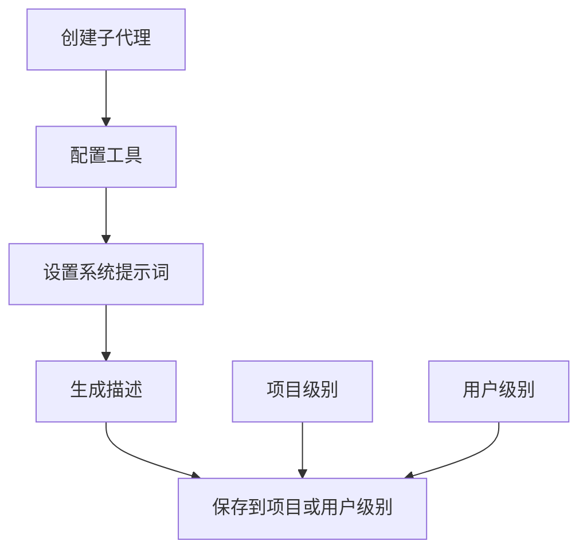

子代理配置包括以下选项：

| 配置项 | 说明 | 可选值 |
|--------|------|--------|
| location | 存储位置 | project / user |
| tools | 启用的工具 | Read/Edit/Web/Search 等 |
| color | 显示颜色 | 预定义颜色值 |
| description | 代理描述 | 自动生成或手动输入 |
| systemPrompt | 系统提示词 | 自定义指令 |

资料来源：[packages/cli/src/ui/components/subagents/create/CreationSummary.tsx]()

### MCP 服务器集成

Qwen Code 支持 MCP（Model Context Protocol）服务器，可扩展工具能力：

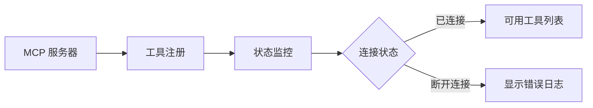

常用 MCP 命令：

| 命令 | 功能 |
|------|------|
| `/mcp list` | 列出所有 MCP 服务器 |
| `/mcp schema` | 显示工具参数模式 |
| `/mcp nodesc` | 隐藏工具描述 |
| `/mcp auth <server>` | OAuth 认证 |
| `Ctrl+T` | 切换工具描述显示 |

资料来源：[packages/cli/src/ui/components/views/McpStatus.tsx]()
资料来源：[packages/cli/src/ui/components/mcp/steps/ToolListStep.tsx]()

## 交互界面

### 工具调用显示

工具调用结果在界面中以卡片形式展示：

| 状态 | 颜色 | 说明 |
|------|------|------|
| success | 绿色 | 执行成功 |
| error | 红色 | 执行失败 |
| warning | 黄色 | 警告信息 |
| loading | 蓝色 | 执行中 |
| pending | 灰色 | 等待中 |

对于文件操作类工具，系统会显示操作结果和文件列表：

```
ToolCallContainer
├── 状态标志
├── 操作描述
└── 文件位置列表
```

资料来源：[packages/webui/src/components/toolcalls/GenericToolCall.tsx]()

### 性能统计

Qwen Code 提供实时性能统计功能：

| 统计项 | 说明 |
|--------|------|
| Wall Time | 总耗时 |
| Agent Active | 代理活跃时间 |
| API Time | API 调用耗时及占比 |
| Tool Time | 工具执行耗时及占比 |
| Token Usage | Token 使用量 |
| Cache Efficiency | 缓存效率 |

资料来源：[packages/cli/src/ui/components/StatsDisplay.tsx]()

### 键盘快捷键

| 功能 | 快捷键 |
|------|--------|
| 确认建议 | `Tab` 或 `Enter` |
| 取消操作 | `Escape` |
| 历史记录上 | `Ctrl+P` |
| 历史记录下 | `Ctrl+N` |
| 导航上 | `Up` |
| 导航下 | `Down` |
| 删除整行 | `Ctrl+U` |
| 清屏 | `Ctrl+L` |
| 提交输入 | `Enter`（无修饰键） |

资料来源：[packages/cli/src/ui/keyMatchers.test.ts]()

## Arena 对战模式

Arena 是 Qwen Code 的代码对比评估功能，可比较不同代理的代码生成结果：

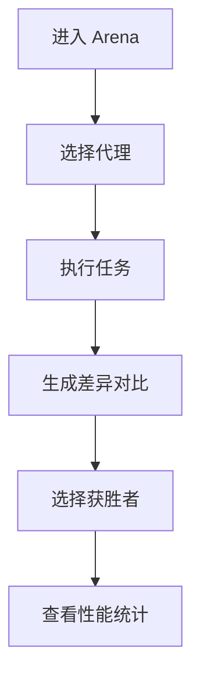

Arena 界面显示：

- **状态信息**：执行状态、耗时、Token 数量、文件数量
- **差异统计**：代码增删行数（绿色添加/红色删除）
- **Token 效率**：各代理的 Token 使用量和运行时间对比

资料来源：[packages/cli/src/ui/components/arena/ArenaSelectDialog.tsx]()
资料来源：[packages/cli/src/ui/components/arena/ArenaCards.tsx]()

## 后台任务管理

Qwen Code 支持后台任务执行，适合长时间运行的任务：

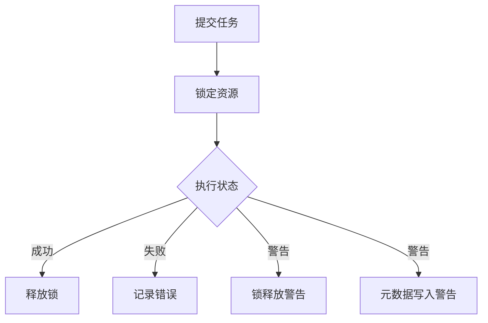

后台任务显示信息包括：

| 信息类型 | 说明 |
|----------|------|
| 会话数量 | 正在审查的会话数 |
| 进度文本 | 当前任务进度 |
| 触达主题 | 已处理的主题列表 |
| 锁定警告 | 锁释放失败提示 |
| 元数据警告 | 元数据写入失败提示 |

资料来源：[packages/cli/src/ui/components/background-view/BackgroundTasksDialog.tsx]()

## 扩展管理

Qwen Code 支持通过扩展增强功能：

| 扩展属性 | 说明 |
|----------|------|
| name | 扩展名称 |
| version | 版本号 |
| status | 启用状态 |
| path | 安装路径 |
| source | 来源信息 |
| mcpServers | 关联的 MCP 服务器 |
| commands | 可用命令列表 |

资料来源：[packages/cli/src/ui/components/extensions/steps/ExtensionDetailStep.tsx]()

## 下一步

完成快速入门后，建议继续阅读以下文档：

- **配置指南**：深入了解配置文件格式和高级选项
- **认证配置**：学习如何配置各种认证方式
- **扩展开发**：了解如何开发自定义扩展
- **API 参考**：查看完整的命令行接口文档

---

<a id='system-architecture'></a>

## 系统架构

### 相关页面

相关主题：[项目概览](#project-overview), [包结构详解](#packages-structure), [智能体运行时](#agent-runtime)

<details>
<summary>相关源码文件</summary>

以下源码文件用于生成本页说明：

- [packages/cli/src/ui/components/arena/ArenaSelectDialog.tsx](https://github.com/QwenLM/qwen-code/blob/main/packages/cli/src/ui/components/arena/ArenaSelectDialog.tsx)
- [packages/cli/src/ui/components/background-view/BackgroundTasksDialog.tsx](https://github.com/QwenLM/qwen-code/blob/main/packages/cli/src/ui/components/background-view/BackgroundTasksDialog.tsx)
- [packages/cli/src/ui/components/mcp/steps/ServerListStep.tsx](https://github.com/QwenLM/qwen-code/blob/main/packages/cli/src/ui/components/mcp/steps/ServerListStep.tsx)
- [packages/cli/src/ui/components/StatsDisplay.tsx](https://github.com/QwenLM/qwen-code/blob/main/packages/cli/src/ui/components/StatsDisplay.tsx)
- [packages/core/src/memory/extractionAgentPlanner.ts](https://github.com/QwenLM/qwen-code/blob/main/packages/core/src/memory/extractionAgentPlanner.ts)
- [README.md](https://github.com/QwenLM/qwen-code/blob/main/README.md)
</details>

# 系统架构

## 概述

Qwen Code 是一个模块化的命令行 AI 编程助手，采用多包架构设计以实现核心逻辑与用户界面的分离。项目主要由 `packages/cli`、`packages/core` 和 `packages/webui` 三个核心包组成，支持扩展机制、后台任务管理、代理（Agent）编排以及 MCP（Model Context Protocol）协议集成。

## 整体架构

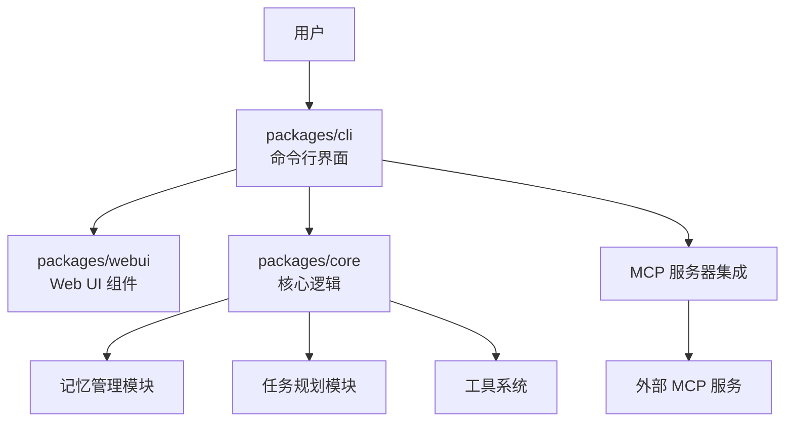

## 核心包结构

### packages/core — 核心逻辑层

核心包负责 AI 代理的核心功能实现，包括任务规划、记忆管理和工具调用。

| 模块 | 路径 | 功能描述 |
|------|------|----------|
| 记忆管理 | `src/memory/` | 管理代理的持久化记忆，包括主题文档自动扫描 |
| 任务规划 | `src/planner/` | 构建和管理任务执行的提示词 |
| 工具系统 | `src/tools/` | 代理可调用的内置工具集合 |

**记忆管理模块**

`extractionAgentPlanner.ts` 实现了记忆提取代理，规划器会扫描项目中的自动记忆主题文档并生成摘要块。该模块支持以下功能：

- 扫描 `auto-memory` 主题文档
- 截断长文本以控制上下文长度
- 构建 Markdown 格式的记忆摘要

资料来源：[packages/core/src/memory/extractionAgentPlanner.ts:1-30]()

### packages/cli — 命令行界面

CLI 包提供终端用户界面，处理用户输入、命令解析和状态展示。

| 组件目录 | 功能 |
|----------|------|
| `ui/components/arena/` | 对战竞技场界面，支持代理选择、对话预览、差异对比 |
| `ui/components/background-view/` | 后台任务对话框，显示进度、错误、锁定警告 |
| `ui/components/mcp/` | MCP 服务器和工具列表管理 |
| `ui/components/extensions/` | 扩展详情展示 |
| `ui/components/subagents/` | 子代理创建和配置 |
| `ui/components/views/` | 状态视图组件 |

**Arena 竞技场组件**

Arena 模块支持多代理并行对比功能。`ArenaSelectDialog.tsx` 实现了代理选择对话框，提供以下状态信息展示：

- 运行状态及颜色编码
- 运行时长
- Token 消耗统计
- 代码变更（增加/删除行数）
- 涉及文件数量

资料来源：[packages/cli/src/ui/components/arena/ArenaSelectDialog.tsx:1-40]()

**后台任务管理**

`BackgroundTasksDialog.tsx` 实现了后台任务监控界面，支持以下功能：

- 任务进度文本显示
- Session 计数展示
- 主题追踪列表
- 错误状态展示
- 锁定释放警告
- 元数据写入警告

资料来源：[packages/cli/src/ui/components/background-view/BackgroundTasksDialog.tsx:1-80]()

**MCP 集成**

MCP 模块负责与外部 MCP 服务器的通信：

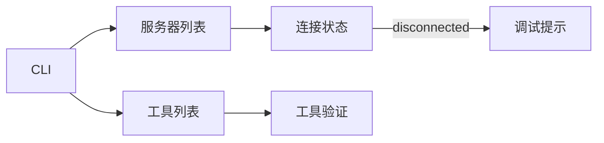

- `ServerListStep.tsx`: 显示 MCP 服务器列表及连接状态
- `ToolListStep.tsx`: 显示可用工具列表，支持滚动和选择
- 无效工具显示警告信息及原因

资料来源：[packages/cli/src/ui/components/mcp/steps/ServerListStep.tsx:1-50]()
资料来源：[packages/cli/src/ui/components/mcp/steps/ToolListStep.tsx:1-60]()

### packages/webui — Web UI 组件库

WebUI 包提供可复用的 React 组件，支持 Storybook 文档化。

| 组件类别 | 组件 |
|----------|------|
| 图标 | FileIcon, FolderIcon, CheckIcon, ErrorIcon, WarningIcon |
| 布局 | Container, Header, Footer, Sidebar, Main |
| 消息 | Message, MessageList, MessageInput, WaitingMessage |
| 工具调用 | ToolCallCard, ToolCallRow |

**Platform Context**

提供平台特定能力的抽象层：

```tsx
import { PlatformProvider, usePlatform } from '@qwen-code/webui/context';
```

## 统计与性能监控

`StatsDisplay.tsx` 组件负责展示运行统计数据：

| 统计类别 | 指标 |
|----------|------|
| 代码变更 | 新增行数、删除行数 |
| 性能 | 墙钟时间、代理活跃时间 |
| 时间分析 | API 调用时间及占比、工具调用时间及占比 |
| 模型使用 | 各模型 Token 消耗、缓存效率 |

资料来源：[packages/cli/src/ui/components/StatsDisplay.tsx:1-60]()

## 扩展机制

扩展系统支持自定义功能和 MCP 服务器集成：

- 扩展版本和路径信息展示
- 激活状态管理
- MCP 服务器关联配置
- 自定义命令注册

资料来源：[packages/cli/src/ui/components/extensions/steps/ExtensionDetailStep.tsx:1-50]()

## 键盘交互系统

CLI 实现了一套完整的键盘快捷键匹配系统：

| 命令 | 快捷键 |
|------|--------|
| 接受建议 | Tab / Enter |
| 清除输入 | Ctrl+C |
| 历史上一条 | Ctrl+P |
| 历史下一条 | Ctrl+N |
| 导航上/下 | 方向键 |
| 退出 | Escape |

## 子代理创建流程

`CreationSummary.tsx` 组件展示子代理创建的配置摘要：

- 位置选择：项目级（`.qwen/agents/`）或用户级（`~/.qwen/agents/`）
- 工具配置显示
- 颜色标识
- 系统提示词和描述预览

资料来源：[packages/cli/src/ui/components/subagents/create/CreationSummary.tsx:1-50]()

## 数据流架构

```mermaid
graph TD
    Input[用户输入] --> AtCmd[@ 命令处理]
    AtCmd --> Processor[命令处理器]
    Processor --> Config[配置系统]
    Config --> Agent[代理执行]
    Agent --> Tools[工具调用]
    Tools --> Mcp[MCP 协议]
    Mcp --> External[外部服务]
    Agent --> Memory[记忆更新]
    Memory --> UI[UI 更新]
    UI --> Stats[统计展示]
```

## 配置模型

项目支持灵活的配置模型，支持多个模型提供商：

```json
{
  "modelProviders": {
    "openai": [
      {
        "id": "qwen3.6-plus",
        "name": "qwen3.6-plus",
        "baseUrl": "https://...",
        "envKey": "API_KEY",
        "generationConfig": {}
      }
    ]
  }
}
```

支持的配置项：

- 模型 ID 和名称
- API Base URL
- 环境变量密钥
- 生成配置（温度、最大 token 等）
- 思考模式启用

资料来源：[README.md:1-50]()

## 技术栈总结

| 层级 | 技术 |
|------|------|
| 核心运行时 | TypeScript/Node.js |
| CLI 界面 | React + Ink（终端 UI 框架） |
| Web UI | React + Tailwind CSS |
| 构建工具 | Vite |
| 文档站点 | Next.js + Nextra |
| 测试 | Vitest |

---

<a id='packages-structure'></a>

## 包结构详解

### 相关页面

相关主题：[系统架构](#system-architecture)

<details>
<summary>相关源码文件</summary>

以下源码文件用于生成本页说明：

- [packages/cli/README.md](https://github.com/QwenLM/qwen-code/blob/main/packages/cli/README.md)
- [packages/webui/README.md](https://github.com/QwenLM/qwen-code/blob/main/packages/webui/README.md)
- [docs-site/README.md](https://github.com/QwenLM/qwen-code/blob/main/docs-site/README.md)
- [packages/core/src/memory/extractionAgentPlanner.ts](https://github.com/QwenLM/qwen-code/blob/main/packages/core/src/memory/extractionAgentPlanner.ts)
- [packages/core/src/utils/toml-to-markdown-converter.ts](https://github.com/QwenLM/qwen-code/blob/main/packages/core/src/utils/toml-to-markdown-converter.ts)
- [README.md](https://github.com/QwenLM/qwen-code/blob/main/README.md)
</details>

# 包结构详解

## 项目概述

Qwen Code 是一个采用 Monorepo（单仓库）结构管理的多语言 SDK 项目。根据项目根目录的 `README.md` 和各子包的文档，该项目包含了 **CLI 命令行工具**、**WebUI 界面**、**Core 核心库**、**文档站点** 等多个子包。

资料来源：[README.md:1-50]()

## 整体架构

Qwen Code 采用 monorepo 结构组织代码，所有子包位于 `packages/` 目录下。核心子包包括：

| 子包名称 | 路径 | 技术栈 | 用途 |
|---------|------|--------|------|
| cli | `packages/cli/` | TypeScript/Node.js | 命令行交互界面 |
| webui | `packages/webui/` | React/Vite/TypeScript | Web 图形界面 |
| core | `packages/core/` | TypeScript | 核心逻辑与 API |
| docs-site | `docs-site/` | Next.js/MDX | 文档网站 |

资料来源：[packages/webui/README.md:1-30]()

## 子包详细结构

### packages/cli

CLI 子包是用户与 Qwen Code 交互的主要入口，提供终端 UI 界面。

```
packages/cli/
├── src/
│   ├── ui/
│   │   ├── components/        # UI 组件目录
│   │   │   ├── arena/         # Arena 对战组件
│   │   │   ├── background-view/  # 后台任务视图
│   │   │   ├── extensions/    # 扩展管理组件
│   │   │   ├── subagents/     # 子代理创建组件
│   │   │   ├── mcp/           # MCP 服务器管理组件
│   │   │   ├── messages/      # 消息渲染组件
│   │   │   ├── hooks/         # Hook 配置组件
│   │   │   ├── views/         # 状态视图组件
│   │   │   └── DiffRenderer.tsx  # 差异渲染器
│   │   ├── commands/          # 命令定义
│   │   └── App.tsx            # 主应用组件
│   ├── i18n/                  # 国际化配置
│   │   ├── locales/           # 语言文件
│   │   └── mustTranslateKeys.test.ts  # 翻译覆盖测试
│   └── hooks/                 # 自定义 Hooks
└── package.json
```

核心 UI 组件功能说明：

| 组件 | 文件路径 | 功能 |
|------|----------|------|
| ArenaSelectDialog | `ui/components/arena/ArenaSelectDialog.tsx` | Agent 对战选择对话框 |
| BackgroundTasksDialog | `ui/components/background-view/BackgroundTasksDialog.tsx` | 后台任务管理 |
| ExtensionDetailStep | `ui/components/extensions/steps/ExtensionDetailStep.tsx` | 扩展详情步骤 |
| ServerListStep | `ui/components/mcp/steps/ServerListStep.tsx` | MCP 服务器列表 |
| ToolListStep | `ui/components/mcp/steps/ToolListStep.tsx` | 工具列表显示 |
| McpStatus | `ui/components/views/McpStatus.tsx` | MCP 状态视图 |
| StatsDisplay | `ui/components/StatsDisplay.tsx` | 统计信息展示 |

资料来源：[packages/cli/README.md](https://github.com/QwenLM/qwen-code/blob/main/packages/cli/README.md)

### packages/webui

WebUI 子包提供基于 React 的图形化界面，支持 Storybook 组件预览。

```
packages/webui/
├── src/
│   ├── components/
│   │   ├── icons/             # 图标组件
│   │   ├── layout/            # 布局组件
│   │   ├── messages/          # 消息组件
│   │   └── ui/                # UI 基础组件
│   ├── context/               # 平台上下文
│   ├── hooks/                 # 自定义 React Hooks
│   └── types/                 # TypeScript 类型定义
├── .storybook/                # Storybook 配置
├── tailwind.preset.cjs        # Tailwind 预设
└── vite.config.ts             # Vite 构建配置
```

开发命令：

```bash
# 启动 Storybook
cd packages/webui && npm run storybook

# 构建生产版本
npm run build

# 类型检查
npm run typecheck
```

资料来源：[packages/webui/README.md:1-60]()

### packages/core

Core 子包包含核心业务逻辑，包括内存管理、内容生成等功能。

```
packages/core/
├── src/
│   ├── memory/
│   │   ├── prompt.ts              # 内存提示词配置
│   │   └── extractionAgentPlanner.ts  # 提取代理规划器
│   ├── core/
│   │   └── openaiContentGenerator/  # OpenAI 内容生成器
│   └── utils/
│       └── toml-to-markdown-converter.ts  # TOML 转 Markdown 工具
```

核心模块说明：

**内存管理模块 (`memory/`)**

内存管理模块负责管理对话中的持久化记忆，支持外部系统引用、主题文档扫描等功能。

- `prompt.ts` - 定义内存保存的规则和示例，包含 WHAT_NOT_TO_SAVE_SECTION 等常量
- `extractionAgentPlanner.ts` - 提供 `buildTopicSummaryBlock` 和 `buildTaskPrompt` 等函数用于构建主题摘要

**内容生成模块 (`openaiContentGenerator/`)**

`openaiContentGenerator.ts` 实现内容嵌入和生成功能：

```typescript
const embedding = await this.pipeline.client.embeddings.create({
  model: 'text-embedding-ada-002',
  input: text,
});
```

**工具函数 (`utils/`)**

`toml-to-markdown-converter.ts` 提供 TOML 格式检测和转换功能：

- `isTomlFormat(content: string): boolean` - 检测内容是否为 TOML 格式

资料来源：[packages/core/src/memory/prompt.ts:1-30]()

### docs-site

文档站点基于 Next.js 和 Nextra 构建，提供项目文档的 Web 展示。

```
docs-site/
├── src/
│   └── app/
│       ├── [[...mdxPath]]/        # 动态 MDX 路由
│       │   └── page.jsx
│       └── layout.jsx             # 根布局
├── mdx-components.js               # MDX 组件配置
├── next.config.mjs                # Next.js 配置
└── package.json
```

文档内容通过符号链接从 `../docs` 目录挂载：

```bash
npm run link  # 创建符号链接
npm run dev   # 启动开发服务器
```

资料来源：[docs-site/README.md:1-40]()

## 依赖关系图

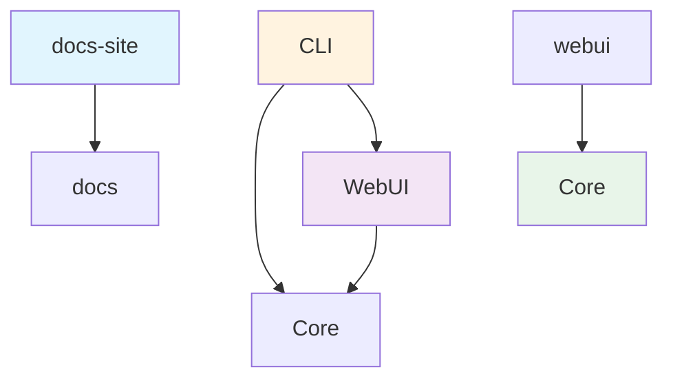

## 技术栈总结

| 层级 | 技术选型 |
|------|----------|
| 基础语言 | TypeScript |
| 前端框架 | React 18+ |
| 构建工具 | Vite (webui) / Next.js (docs) |
| UI 框架 | Tailwind CSS |
| 组件测试 | Storybook |
| 国际化 | 自定义 i18n 方案 |
| 包管理 | npm |

## 许可证

Qwen Code 项目采用 Apache-2.0 许可证发布。

资料来源：[packages/webui/README.md:60]()

---

**注意**：以上包结构基于仓库中实际存在的文件和目录结构整理。部分高级包（如 `channels/`、`sdk-typescript/`、`sdk-python/`、`sdk-java/`）在当前代码快照中未包含详细源码，如需深入了解请查阅对应子包的完整源码。

---

<a id='agent-runtime'></a>

## 智能体运行时

### 相关页面

相关主题：[工具系统](#tool-system), [模型集成](#model-integration), [会话管理](#session-management)

<details>
<summary>相关源码文件</summary>

以下源码文件用于生成本页说明：

- [packages/cli/src/ui/components/arena/ArenaSelectDialog.tsx](https://github.com/QwenLM/qwen-code/blob/main/packages/cli/src/ui/components/arena/ArenaSelectDialog.tsx)
- [packages/cli/src/ui/components/background-view/BackgroundTasksDialog.tsx](https://github.com/QwenLM/qwen-code/blob/main/packages/cli/src/ui/components/background-view/BackgroundTasksDialog.tsx)
- [packages/cli/src/ui/components/messages/ToolGroupMessage.test.tsx](https://github.com/QwenLM/qwen-code/blob/main/packages/cli/src/ui/components/messages/ToolGroupMessage.test.tsx)
- [packages/cli/src/ui/components/StatsDisplay.tsx](https://github.com/QwenLM/qwen-code/blob/main/packages/cli/src/ui/components/StatsDisplay.tsx)
- [packages/cli/src/ui/contexts/UIActionsContext.tsx](https://github.com/QwenLM/qwen-code/blob/main/packages/cli/src/ui/contexts/UIActionsContext.tsx)
- [packages/core/src/memory/prompt.ts](https://github.com/QwenLM/qwen-code/blob/main/packages/core/src/memory/prompt.ts)
</details>

# 智能体运行时

## 概述

智能体运行时（Agent Runtime）是 Qwen Code 系统中负责协调和管理智能体（Agent）生命周期、任务执行、工具调用的核心模块。它提供了智能体的交互式执行环境、后台任务管理、权限控制、以及运行时状态监控等功能。智能体运行时与 UI 层紧密集成，通过事件驱动的架构实现用户与智能体之间的实时交互。

智能体运行时的设计目标是为 AI 编程助手提供一个可扩展、安全且响应迅速的执行环境，支持单智能体任务执行和多智能体协作（如 Arena 对战模式）。

## 核心架构

### 组件层次

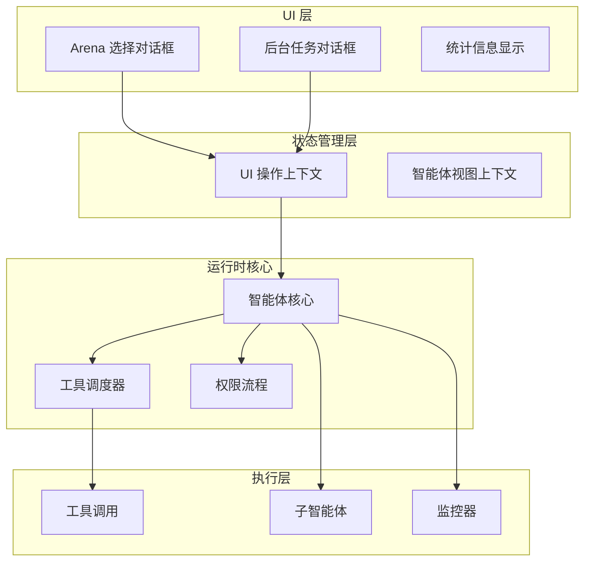

### 智能体状态模型

智能体运行时通过 `AgentResultDisplay` 类型定义智能体的执行状态：

| 状态值 | 含义 | UI 显示 |
|--------|------|---------|
| `running` | 任务正在执行中 | 显示进度条和活动指示器 |
| `completed` | 任务已完成 | 显示成功状态和结果摘要 |
| `failed` | 任务执行失败 | 显示错误信息 |
| `cancelled` | 任务被取消 | 显示取消状态 |

资料来源：[packages/cli/src/ui/components/messages/ToolGroupMessage.test.tsx:9-25]()

```typescript
interface AgentResultDisplay {
  type: 'task_execution';
  subagentName: string;
  taskDescription: string;
  taskPrompt: string;
  status: 'running' | 'completed' | 'failed' | 'cancelled';
  toolCalls: ToolCall[];
}
```

## 任务执行机制

### 工具调用链

智能体运行时通过 `ToolCall` 结构管理所有工具调用操作。每个工具调用包含唯一标识符、调用名称、执行状态和结果描述。

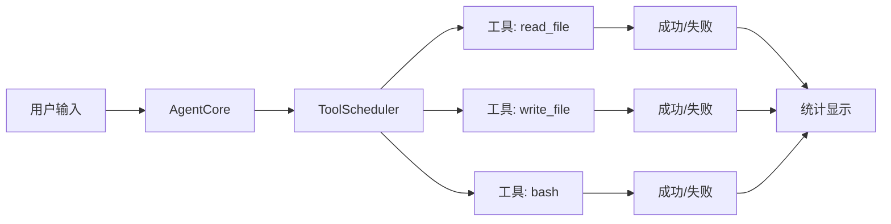

### 工具调用数据结构

| 字段 | 类型 | 说明 |
|------|------|------|
| `callId` | string | 唯一调用标识符 |
| `name` | string | 工具名称（如 `read_file`、`agent`） |
| `status` | ToolCallStatus | 执行状态（executing、success、error） |
| `description` | string | 调用描述信息 |
| `resultDisplay` | AgentResultDisplay | 子智能体结果展示（可选） |

资料来源：[packages/cli/src/ui/components/messages/ToolGroupMessage.test.tsx:27-34]()

### 子智能体任务

当智能体调用 `agent` 工具时，运行时会创建子智能体任务。子智能体继承父智能体的上下文，可以独立执行特定任务：

```typescript
// 子智能体任务创建示例
{
  type: 'task_execution',
  subagentName: 'reviewer',
  taskDescription: 'reviewer task',
  taskPrompt: 'Run reviewer',
  status: 'running',
  toolCalls: [
    {
      callId: 'reviewer-read-1',
      name: 'read_file',
      status: 'success',
      description: 'Read file'
    }
  ]
}
```

子智能体运行时保持了焦点机制，使 Ctrl+E 快捷键可以展开查看详细信息。运行中的子智能体显示为 `focused=true`，而完成的子智能体可以正常折叠。

资料来源：[packages/cli/src/ui/components/messages/ToolGroupMessage.test.tsx:63-68]()

## Arena 模式

### Arena 选择对话框

Arena 是 Qwen Code 支持的多智能体对战模式。用户可以通过 Arena 选择对话框选择不同的智能体进行对比测试或对战。

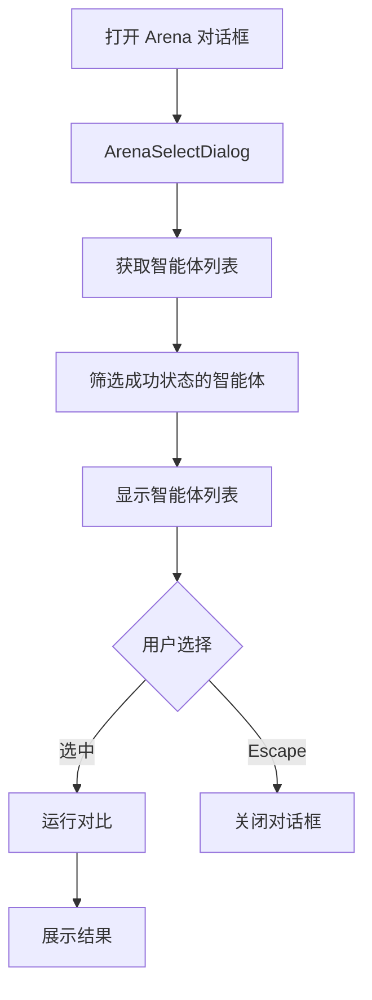

### 智能体选择状态

Arena 对话框中的每个智能体选项显示以下信息：

| 显示字段 | 数据来源 | 说明 |
|----------|----------|------|
| 状态图标 | `statusInfo.color` / `statusInfo.text` | 根据状态着色 |
| 执行时长 | `duration` | 任务耗时 |
| Token 数量 | `tokens` | 消耗的 Token 数 |
| 文件数量 | `fileCount` | 涉及的文件数 |
| 代码变更 | `diffAdditions` / `diffDeletions` | 新增/删除行数 |

资料来源：[packages/cli/src/ui/components/arena/ArenaSelectDialog.tsx:1-22]()

### 快捷键绑定

Arena 对话框支持以下键盘交互：

| 快捷键 | 功能 |
|--------|------|
| `Escape` | 关闭 Arena 对话框 |
| `P` | 切换预览视图（Show/Hide Preview） |
| `D` | 切换详细 Diff 视图 |

资料来源：[packages/cli/src/ui/components/arena/ArenaSelectDialog.tsx:39-50]()

### Arena 操作上下文

Arena 相关的操作通过 `UIActionsContext` 统一管理：

| 方法 | 功能 |
|------|------|
| `openArenaDialog(type)` | 打开指定类型的 Arena 对话框 |
| `closeArenaDialog()` | 关闭 Arena 对话框 |
| `handleArenaModelsSelected(models)` | 处理用户选择的模型列表 |

资料来源：[packages/cli/src/ui/contexts/UIActionsContext.tsx:31-33]()

## 后台任务管理

### 后台任务对话框

BackgroundTasksDialog 组件负责展示和管理后台运行的智能体任务，包括长时间运行的任务、监控事件和会话状态。

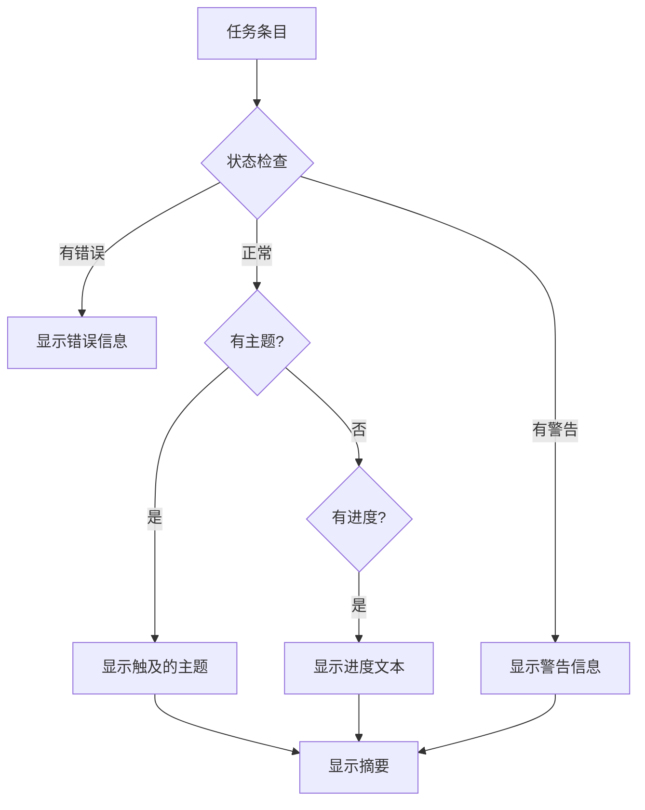

### 任务状态展示

| 组件 | 显示内容 | 样式 |
|------|----------|------|
| 状态文本 | 状态描述文字 | 根据状态着色 |
| Sessions reviewing | 活跃会话数 | 加粗、次要颜色 |
| Progress | 进度文本 | 单独区块 |
| Topics touched | 涉及的主题列表 | 缩进列表形式 |
| Error | 错误信息 | 红色高亮 |
| Lock release warning | 锁释放警告 | 黄色警告色 |

资料来源：[packages/cli/src/ui/components/background-view/BackgroundTasksDialog.tsx:1-80]()

### 锁释放错误处理

当任务执行过程中出现锁释放错误时，系统会显示专门的警告信息：

```
Lock release warning: <错误描述>
Subsequent dreams may be skipped as locked until the next session's staleness sweep cleans the file.
```

这种设计确保终端状态保持为"已完成"，同时通过警告形式解释后续任务可能被跳过的原因。

资料来源：[packages/cli/src/ui/components/background-view/BackgroundTasksDialog.tsx:37-50]()

## 监控器系统

### 监控通知机制

智能体运行时支持监控器（Monitor）功能，用于追踪长时间运行的任务和事件流。监控通知通过 XML 格式的回调函数传递：

```typescript
type MonitorNotificationCallback = (
  displayText: string,        // 显示给用户的文本
  modelText: string,          // 模型原始文本
  meta: {
    monitorId: string;        // 监控器 ID
    toolUseId?: string;       // 关联的工具调用 ID
    status: 'running' | 'completed' | 'failed' | 'cancelled';
    eventCount: number;       // 事件计数
  }
) => void;
```

### 监控通知 XML 格式

```xml
<task-notification>
  <task-id>mon_1</task-id>
  <kind>monitor</kind>
  <status>running</status>
  <summary>Monitor emitted event #1.</summary>
  <result>ready</result>
</task-notification>
```

### 监控器生命周期

| 状态 | 含义 |
|------|------|
| `running` | 监控器正在运行，持续接收事件 |
| `completed` | 监控任务已完成 |
| `failed` | 监控执行失败 |
| `cancelled` | 监控被用户取消 |

资料来源：[packages/cli/src/nonInteractiveCli.test.ts:1-50]()

## 性能统计

### 统计信息显示

StatsDisplay 组件展示智能体运行时的性能指标：

| 指标类别 | 具体指标 | 说明 |
|----------|----------|------|
| **代码变更** | totalLinesAdded / totalLinesRemoved | 新增和删除的代码行数 |
| **时间统计** | Wall Time | 墙上时钟时间 |
| | Agent Active Time | 智能体活跃时间 |
| | API Time | API 调用耗时及占比 |
| | Tool Time | 工具执行耗时及占比 |
| **缓存效率** | totalCachedTokens | 缓存的 Token 总数 |
| | cacheEfficiency | 缓存命中率 |

资料来源：[packages/cli/src/ui/components/StatsDisplay.tsx:1-50]()

### 百分比计算

性能统计中的百分比通过以下公式计算：

```
apiTimePercent = (totalApiTime / agentActiveTime) × 100
toolTimePercent = (totalToolTime / agentActiveTime) × 100
cacheEfficiency = (cachedTokens / totalTokens) × 100
```

## 权限与安全

### 权限流程

智能体运行时通过 PermissionFlow 模块管理工具调用的权限请求。当智能体尝试执行受限操作（如文件写入、终端命令）时，系统会弹出权限请求对话框。

| 权限模式 | 说明 |
|----------|------|
| 授权所有 | 自动批准所有权限请求 |
| 逐个确认 | 每个权限请求都需要用户确认 |
| 拒绝所有 | 拒绝所有权限请求 |

资料来源：[packages/core/src/core/permissionFlow.ts]()

### 设置作用域

权限和其他设置支持两种作用域：

| 作用域 | 说明 |
|--------|------|
| `project` | 项目级别设置（`.qwen/` 目录） |
| `user` | 用户级别设置（`~/.qwen/` 目录） |

## 配置与扩展

### MCP 服务器集成

智能体运行时支持 MCP（Model Context Protocol）服务器扩展。运行时通过 `mcpServers` 配置连接外部工具服务：

| 配置项 | 说明 |
|--------|------|
| `path` | MCP 服务器路径 |
| `source` | 安装来源 |
| `commands` | 可用命令列表 |
| `status` | 连接状态（connected/disconnected） |

资料来源：[packages/cli/src/ui/components/extensions/steps/ExtensionDetailStep.tsx:1-40]()

### MCP 服务器状态处理

当存在断开的 MCP 服务器时，系统显示提示信息：

```
※ Run qwen --debug to see error logs
```

资料来源：[packages/cli/src/ui/components/mcp/steps/ServerListStep.tsx:1-30]()

## 总结

智能体运行时是 Qwen Code 系统的核心执行引擎，它协调管理智能体的生命周期、任务调度、工具调用、权限控制和状态监控。该系统通过以下特性提供可靠的 AI 编程辅助体验：

- **状态驱动**：清晰的状态模型支持 UI 层实时反映任务执行状态
- **工具调度**：统一的工具调度器管理所有工具调用和子智能体任务
- **Arena 模式**：支持多智能体对比和协作
- **后台任务**：长时间运行任务的后台管理，减少对主界面的干扰
- **监控通知**：实时事件通知机制，支持长时间任务的追踪
- **性能统计**：详细的运行时性能指标，帮助用户了解资源消耗

---

<a id='tool-system'></a>

## 工具系统

### 相关页面

相关主题：[智能体运行时](#agent-runtime)

<details>
<summary>相关源码文件</summary>

以下源码文件用于生成本页说明：

- [packages/cli/src/ui/components/arena/ArenaSelectDialog.tsx](https://github.com/QwenLM/qwen-code/blob/main/packages/cli/src/ui/components/arena/ArenaSelectDialog.tsx)
- [packages/cli/src/ui/components/extensions/steps/ExtensionDetailStep.tsx](https://github.com/QwenLM/qwen-code/blob/main/packages/cli/src/ui/components/extensions/steps/ExtensionDetailStep.tsx)
- [packages/cli/src/ui/components/mcp/steps/ToolListStep.tsx](https://github.com/QwenLM/qwen-code/blob/main/packages/cli/src/ui/components/mcp/steps/ToolListStep.tsx)
- [packages/cli/src/ui/components/views/McpStatus.tsx](https://github.com/QwenLM/qwen-code/blob/main/packages/cli/src/ui/components/views/McpStatus.tsx)
- [packages/cli/src/ui/components/arena/ArenaCards.tsx](https://github.com/QwenLM/qwen-code/blob/main/packages/cli/src/ui/components/arena/ArenaCards.tsx)
- [packages/cli/src/ui/components/views/ContextUsage.tsx](https://github.com/QwenLM/qwen-code/blob/main/packages/cli/src/ui/components/views/ContextUsage.tsx)
- [packages/cli/src/ui/keyMatchers.test.ts](https://github.com/QwenLM/qwen-code/blob/main/packages/cli/src/ui/keyMatchers.test.ts)
- [packages/cli/src/ui/components/subagents/create/CreationSummary.tsx](https://github.com/QwenLM/qwen-code/blob/main/packages/cli/src/ui/components/subagents/create/CreationSummary.tsx)
</details>

# 工具系统

## 概述

Qwen Code 的工具系统是整个代码智能助手的核心能力模块，它为 AI Agent 提供了与代码库、文件系统、外部服务交互的能力。该系统支持多种类型的工具调用，包括内置工具（如 Shell 执行、文件编辑、LSP 通信）、MCP（Model Context Protocol）服务器工具以及子代理（Subagent）自定义工具。

工具系统在 UI 层通过 `ToolListStep` 组件呈现交互式列表界面，支持工具搜索、选择、滚动浏览等功能。同时，工具使用情况会在 `ContextUsage` 组件中单独统计，显示每个工具消耗的 token 数量。资料来源：[packages/cli/src/ui/components/mcp/steps/ToolListStep.tsx:1-80](https://github.com/QwenLM/qwen-code/blob/main/packages/cli/src/ui/components/mcp/steps/ToolListStep.tsx)，[packages/cli/src/ui/components/views/ContextUsage.tsx:1-100](https://github.com/QwenLM/qwen-code/blob/main/packages/cli/src/ui/components/views/ContextUsage.tsx)

---

## 架构设计

### 系统分层

工具系统采用分层架构设计，从底层到上层依次为：

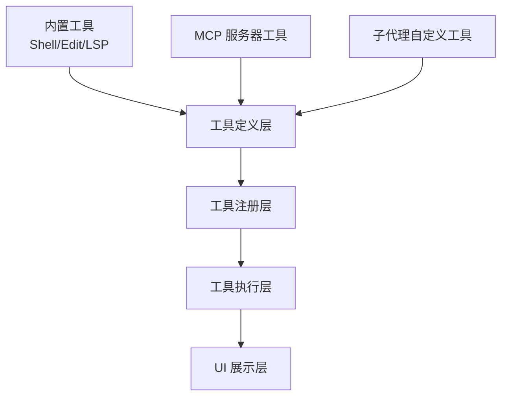

### 工具分类

根据工具的来源和用途，系统中的工具可分为以下几类：

| 类别 | 说明 | 典型示例 |
|------|------|----------|
| 内置工具 | 系统核心能力，硬编码实现 | Shell、Edit、LSP |
| MCP 工具 | 通过 MCP 协议扩展的工具 | 文件系统、Git、数据库等 |
| 子代理工具 | 用户自定义子代理暴露的工具 | 用户定义的各类能力 |
| 技能工具 | 预定义的技能集成 | 代码搜索、测试生成等 |

资料来源：[packages/cli/src/ui/components/subagents/create/CreationSummary.tsx:1-50](https://github.com/QwenLM/qwen-code/blob/main/packages/cli/src/ui/components/subagents/create/CreationSummary.tsx)

---

## 工具注册机制

### 工具注册表

工具通过注册表模式进行统一管理，确保工具的可用性、唯一性和可发现性。注册表维护了所有已注册工具的元数据，包括工具名称、描述、参数模式和有效性状态。

### 工具验证

每个工具在注册时都会经过验证流程：

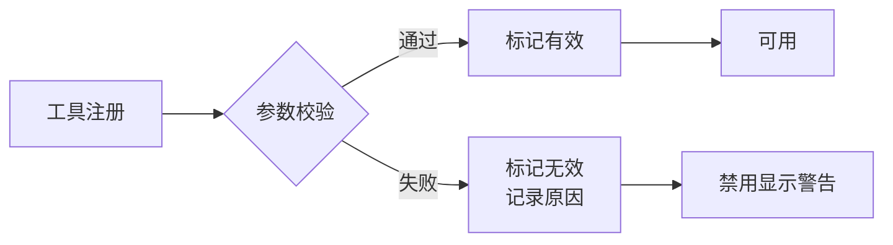

工具的有效性状态直接影响其在 UI 中的展示方式：

```tsx
// 工具列表中无效工具的显示逻辑
{!tool.isValid && (
  <Text color={theme.status.warning}>
    {t('invalid: {{reason}}', {
      reason: tool.invalidReason || t('unknown'),
    })}
  </Text>
)}
```

资料来源：[packages/cli/src/ui/components/mcp/steps/ToolListStep.tsx:45-52](https://github.com/QwenLM/qwen-code/blob/main/packages/cli/src/ui/components/mcp/steps/ToolListStep.tsx)

---

## 内置工具

### Shell 工具

Shell 工具提供了在宿主系统上执行命令的能力，是 AI Agent 与操作系统交互的主要通道。

### Edit 工具

Edit 工具负责文件内容的读取、创建、修改和删除操作，是代码修改的核心能力。

### LSP 工具

LSP（Language Server Protocol）工具集成了语言服务器协议，提供了代码补全、跳转到定义、查找引用等 IDE 级别的功能。

---

## MCP 工具集成

### MCP 协议概述

MCP（Model Context Protocol）是一种标准化的工具扩展协议，允许第三方服务通过标准接口向 Qwen Code 提供工具能力。

### MCP 服务器配置

MCP 服务器在 `ExtensionDetailStep` 组件中展示，包括以下配置项：

| 配置项 | 说明 |
|--------|------|
| `name` | 服务器名称 |
| `version` | 服务器版本 |
| `path` | 服务器路径 |
| `source` | 安装来源 |
| `mcpServers` | 包含的服务器列表 |

```tsx
{ext.mcpServers && Object.keys(ext.mcpServers).length > 0 && (
  <Box>
    <Box width={LABEL_WIDTH} flexShrink={0}>
      <Text color={theme.text.primary}>{t('MCP Servers:')}</Text>
    </Box>
    <Text>{Object.keys(ext.mcpServers).join(', ')}</Text>
  </Box>
)}
```

资料来源：[packages/cli/src/ui/components/extensions/steps/ExtensionDetailStep.tsx:30-45](https://github.com/QwenLM/qwen-code/blob/main/packages/cli/src/ui/components/extensions/steps/ExtensionDetailStep.tsx)

### MCP 工具使用

在 Agent Arena 界面中，MCP 工具的使用情况会详细展示：

```tsx
{agent.toolCalls > 0 && (
  <Text color={theme.text.secondary}>
    {agent.toolCalls === 1 ? '1 tool call)' : `${agent.toolCalls} tool calls)`}
  </Text>
)}
```

资料来源：[packages/cli/src/ui/components/arena/ArenaCards.tsx:1-50](https://github.com/QwenLM/qwen-code/blob/main/packages/cli/src/ui/components/arena/ArenaCards.tsx)

---

## 子代理工具

### 子代理定义

子代理是用户自定义的 AI Agent，具备独立的系统提示、工具集和描述信息。

### 子代理工具配置

创建子代理时可以为其配置以下工具属性：

```tsx
<Box>
  <Text color={theme.text.primary}>{t('Tools: ')}</Text>
  <Text>{toolsDisplay}</Text>
</Box>
```

子代理支持选择性地启用或禁用特定工具，工具配置存储在子代理定义文件中，位于项目级（`.qwen/agents/`）或用户级（`~/.qwen/agents/`）目录。资料来源：[packages/cli/src/ui/components/subagents/create/CreationSummary.tsx:15-25](https://github.com/QwenLM/qwen-code/blob/main/packages/cli/src/ui/components/subagents/create/CreationSummary.tsx)

---

## 工具展示界面

### 工具列表视图

`ToolListStep` 组件提供了交互式工具列表界面：

| 功能 | 说明 |
|------|------|
| 工具名称显示 | 固定宽度列，支持截断显示 |
| 选择指示器 | `❯` 符号标识当前选中 |
| 无效警告 | 显示工具验证失败的原因 |
| 滚动提示 | 显示当前索引和总数 |
| 键盘导航 | 支持上下箭头选择 |

```tsx
// 滚动提示的显示逻辑
{tools.length > VISIBLE_TOOLS_COUNT && (
  <Box marginTop={1}>
    <Text color={theme.text.secondary}>
      {scrollOffset > 0 ? '↑ ' : '  '}
      {t('{{current}}/{{total}}', {
        current: (selectedIndex + 1).toString(),
        total: tools.length.toString(),
      })}
      {scrollOffset + VISIBLE_TOOLS_COUNT < tools.length ? ' ↓' : ''}
    </Text>
  </Box>
)}
```

资料来源：[packages/cli/src/ui/components/mcp/steps/ToolListStep.tsx:65-78](https://github.com/QwenLM/qwen-code/blob/main/packages/cli/src/ui/components/mcp/steps/ToolListStep.tsx)

### MCP 状态视图

`McpStatus` 组件展示了 MCP 工具的详细使用说明：

```tsx
<Text>- {t('Use')} <Text color={theme.text.accent}>/mcp</Text> {t('to list all available tools')}</Text>
<Text>- {t('Use')} <Text color={theme.text.accent}>/mcp schema</Text> {t('to show tool parameter schemas')}</Text>
<Text>- {t('Use')} <Text color={theme.text.accent}>/mcp nodesc</Text> {t('to hide descriptions')}</Text>
<Text>- {t('Use')} <Text color={theme.text.accent}>/mcp auth &lt;server-name&gt;</Text> {t('to authenticate with OAuth-enabled servers')}</Text>
```

资料来源：[packages/cli/src/ui/components/views/McpStatus.tsx:1-30](https://github.com/QwenLM/qwen-code/blob/main/packages/cli/src/ui/components/views/McpStatus.tsx)

### 上下文使用统计

`ContextUsage` 组件将工具使用情况纳入上下文统计：

```tsx
{/* MCP Tools detail */}
{sortedMcpTools.length > 0 && (
  <Box flexDirection="column" marginTop={1}>
    <Text bold color={theme.text.primary}>
      {t('MCP tools')}
    </Text>
    {sortedMcpTools.map((tool) => (
      <DetailRow
        key={tool.name}
        name={tool.name}
        tokens={tool.tokens}
      />
    ))}
  </Box>
)}
```

资料来源：[packages/cli/src/ui/components/views/ContextUsage.tsx:40-55](https://github.com/QwenLM/qwen-code/blob/main/packages/cli/src/ui/components/views/ContextUsage.tsx)

---

## 键盘快捷键

工具系统支持以下键盘快捷键操作：

| 快捷键 | 功能 |
|--------|------|
| `Ctrl+T` | 切换工具描述显示/隐藏 |
| `Ctrl+G` | 切换 IDE 上下文详情 |
| `↑/↓` | 导航工具列表 |
| `Escape` | 关闭工具对话框 |
| `Tab` 或 `Enter` | 接受工具建议 |

```ts
[Command.TOGGLE_TOOL_DESCRIPTIONS]: (key: Key) =>
  key.ctrl && key.name === 't',
[Command.TOGGLE_IDE_CONTEXT_DETAIL]: (key: Key) =>
  key.ctrl && key.name === 'g',
```

资料来源：[packages/cli/src/ui/keyMatchers.test.ts:1-50](https://github.com/QwenLM/qwen-code/blob/main/packages/cli/src/ui/keyMatchers.test.ts)

---

## Arena 场景中的工具使用

在 Agent Arena 对比场景中，工具使用情况会被详细记录和展示：

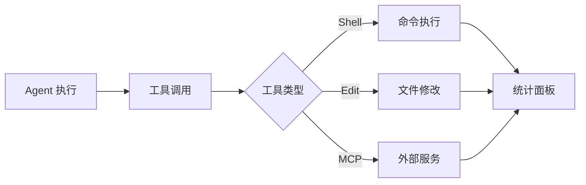

Arena 界面展示每个 Agent 的工具调用统计：

- **工具调用次数**：显示每个 Agent 执行了多少次工具调用
- **Token 效率**：统计总 token 消耗和运行时长
- **Diff 统计**：显示代码变更的行数（新增/删除）

```tsx
<Box flexDirection="column">
  <Text bold color={theme.text.primary}>
    Token Efficiency:
  </Text>
  {agents.map((agent, index) => (
    <Box key={agent.label} marginLeft={2}>
      <Text color={theme.text.secondary}>
        {index === agents.length - 1 ? '└─' : '├─'} {agent.label}:{' '}
      </Text>
      <Text color={theme.text.primary}>
        {agent.totalTokens.toLocaleString()} tokens · runtime {formatDuration(agent.durationMs)}
      </Text>
    </Box>
  ))}
</Box>
```

资料来源：[packages/cli/src/ui/components/arena/ArenaCards.tsx:50-70](https://github.com/QwenLM/qwen-code/blob/main/packages/cli/src/ui/components/arena/ArenaCards.tsx)

---

## 扩展性设计

### 工具扩展点

工具系统设计了多个扩展点以支持第三方集成：

1. **MCP 服务器插件**：通过 MCP 协议接入外部工具服务
2. **子代理自定义**：用户可定义专属工具集
3. **内置工具扩展**：系统内置工具支持扩展配置

### 错误处理

工具执行过程中的错误会通过统一的错误展示界面呈现：

```tsx
{hasError && (
  <Fragment>
    <Box />
    <Box>
      <Text bold color={theme.status.error}>
        {t('Error')}
      </Text>
    </Box>
    <Box>
      <Text color={theme.status.error} wrap="wrap">
        {entry.error}
      </Text>
    </Box>
  </Fragment>
)}
```

---

## 配置管理

### 工具配置文件

工具系统的配置通过以下位置管理：

| 配置位置 | 范围 | 说明 |
|----------|------|------|
| `.qwen/agents/` | 项目级 | 项目专属工具配置 |
| `~/.qwen/agents/` | 用户级 | 全局工具配置 |

### 工具描述控制

工具描述的显示可通过命令行参数控制：

- `/mcp` - 列出所有可用工具
- `/mcp schema` - 显示工具参数模式
- `/mcp nodesc` - 隐藏工具描述
- `Ctrl+T` - 切换工具描述显示

---

## 总结

Qwen Code 的工具系统采用了模块化、分层式的架构设计，通过统一的注册机制管理内置工具、MCP 工具和子代理工具。系统提供了丰富的 UI 组件用于工具的展示、选择和统计，同时支持通过键盘快捷键进行高效操作。工具系统的扩展性设计使得第三方服务能够方便地通过 MCP 协议接入，为 AI Agent 提供更强大的能力。

---

<a id='model-integration'></a>

## 模型集成

### 相关页面

相关主题：[智能体运行时](#agent-runtime), [快速入门](#quick-start)

<details>
<summary>相关源码文件</summary>

以下源码文件用于生成本页说明：

- [packages/core/src/core/openaiContentGenerator/openaiContentGenerator.ts](https://github.com/QwenLM/qwen-code/blob/main/packages/core/src/core/openaiContentGenerator/openaiContentGenerator.ts)
- [packages/core/src/core/openaiContentGenerator/provider/dashscope.ts](https://github.com/QwenLM/qwen-code/blob/main/packages/core/src/core/openaiContentGenerator/provider/dashscope.ts)
- [packages/core/src/core/openaiContentGenerator/provider/openrouter.ts](https://github.com/QwenLM/qwen-code/blob/main/packages/core/src/core/openaiContentGenerator/provider/openrouter.ts)
- [packages/core/src/core/geminiChat.ts](https://github.com/QwenLM/qwen-code/blob/main/packages/core/src/core/geminiChat.ts)
- [packages/core/src/core/anthropicContentGenerator/anthropicContentGenerator.ts](https://github.com/QwenLM/qwen-code/blob/main/packages/core/src/core/anthropicContentGenerator/anthropicContentGenerator.ts)
- [README.md](https://github.com/QwenLM/qwen-code/blob/main/README.md)
- [packages/core/src/memory/extractionAgentPlanner.ts](https://github.com/QwenLM/qwen-code/blob/main/packages/core/src/memory/extractionAgentPlanner.ts)
</details>

# 模型集成

## 概述

模型集成是 Qwen Code 框架的核心子系统，负责与各类大语言模型（LLM）提供商建立通信连接、发送请求并处理响应。该系统通过统一的内容生成器接口抽象不同提供商的实现细节，使上层业务逻辑能够以一致的方式调用各种模型服务。资料来源：[packages/core/src/core/openaiContentGenerator/openaiContentGenerator.ts]()

## 架构设计

### 整体架构

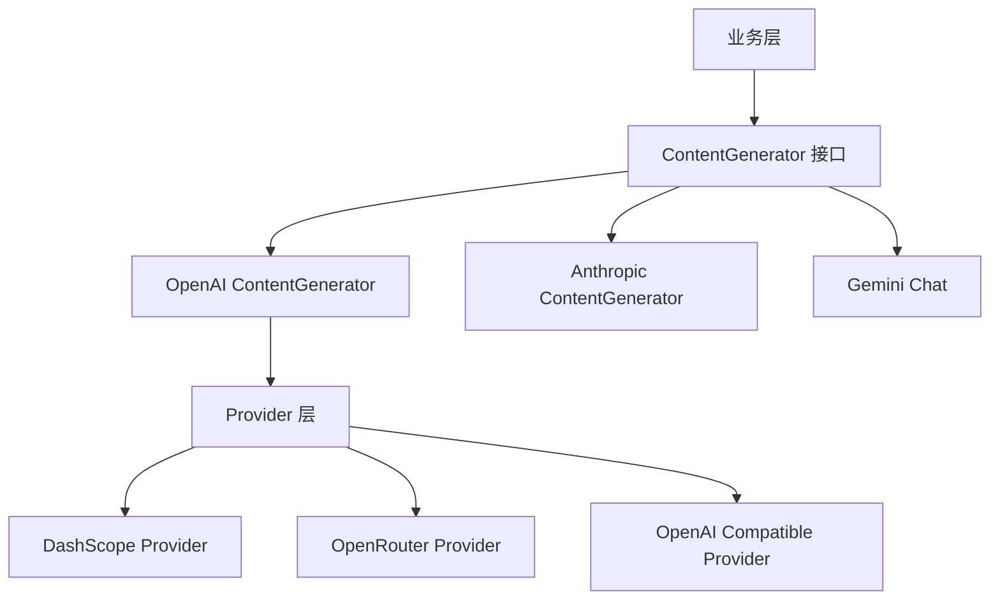

### 核心接口抽象

系统定义了统一的内容生成器接口，所有具体实现必须遵循该契约：

| 接口方法 | 功能描述 | 参数 |
|---------|---------|------|
| `generate(prompt, options)` | 生成内容 | 提示词、生成配置 |
| `stream(prompt, options)` | 流式生成 | 提示词、生成配置 |
| `getModel()` | 获取当前模型 | 无 |
| `getName()` | 获取生成器名称 | 无 |

资料来源：[packages/core/src/core/openaiContentGenerator/openaiContentGenerator.ts:30-80]()

## Provider 实现体系

### DashScope Provider（阿里云）

DashScope 是阿里云提供的大模型服务，Qwen Code 通过专门的 Provider 进行集成：

```typescript
// packages/core/src/core/openaiContentGenerator/provider/dashscope.ts
export class DashScopeProvider implements ModelProvider {
  readonly baseUrl = 'https://dashscope.aliyuncs.com/compatible-mode/v1';
  
  async chat(params: ChatParams): Promise<ChatResponse> {
    // 实现与阿里云 DashScope API 的通信
  }
}
```

**配置示例：**

```json
{
  "modelProviders": {
    "openai": [
      {
        "id": "qwen3.6-plus",
        "name": "qwen3.6-plus (Coding Plan)",
        "baseUrl": "https://coding.dashscope.aliyuncs.com/v1",
        "description": "qwen3.6-plus from ModelStudio Coding Plan",
        "envKey": "BAILIAN_CODING_PLAN_API_KEY"
      }
    ]
  }
}
```

资料来源：[packages/core/src/core/openaiContentGenerator/provider/dashscope.ts]()

### OpenRouter Provider

OpenRouter 提供对多种模型的统一访问接口：

```typescript
// packages/core/src/core/openaiContentGenerator/provider/openrouter.ts
export class OpenRouterProvider implements ModelProvider {
  readonly baseUrl = 'https://openrouter.ai/api/v1';
  
  async chat(params: ChatParams): Promise<ChatResponse> {
    // 实现与 OpenRouter API 的通信
  }
}
```

资料来源：[packages/core/src/core/openaiContentGenerator/provider/openrouter.ts]()

### OpenAI 兼容 Provider

通用的 OpenAI API 兼容实现，可连接任何遵循 OpenAI API 规范的服务：

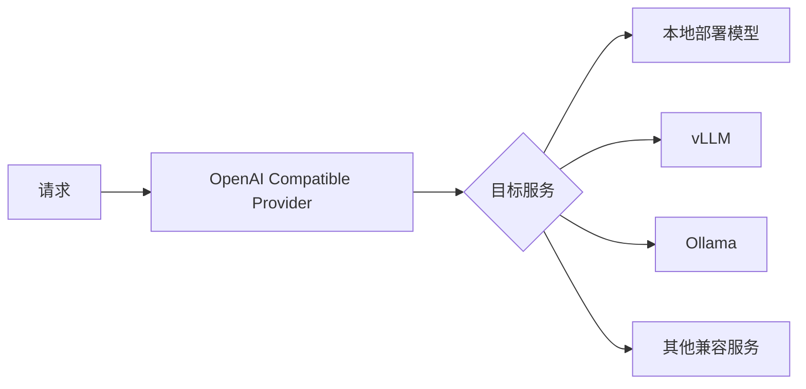

**vLLM 配置示例：**

```json
{
  "modelProviders": {
    "openai": [
      {
        "id": "Qwen/Qwen3-32B",
        "name": "Qwen3 32B (vLLM)",
        "baseUrl": "http://localhost:8000/v1",
        "description": "Qwen3 32B running locally via vLLM",
        "generationConfig": {
          "contextWindowSize": 131072
        }
      }
    ]
  }
}
```

**Ollama 配置示例：**

```json
{
  "modelProviders": {
    "openai": [
      {
        "id": "qwen3:32b",
        "name": "Qwen3 32B (Ollama)",
        "baseUrl": "http://localhost:11434/v1",
        "description": "Qwen3 32B running locally via Ollama",
        "generationConfig": {
          "contextWindowSize": 131072
        }
      }
    ]
  }
}
```

资料来源：[README.md:50-120]()

## Anthropic Claude 集成

### 内容生成器实现

Anthropic Claude 通过专门的内容生成器进行集成：

```typescript
// packages/core/src/core/anthropicContentGenerator/anthropicContentGenerator.ts
export class AnthropicContentGenerator implements ContentGenerator {
  private readonly client: Anthropic;
  
  async generate(
    prompt: string,
    options?: GenerationOptions
  ): Promise<GenerationResult> {
    const message = await this.client.messages.create({
      model: this.model,
      max_tokens: options?.maxTokens ?? 4096,
      messages: [{ role: 'user', content: prompt }],
    });
    
    return {
      content: message.content[0].text,
      usage: {
        inputTokens: message.usage.input_tokens,
        outputTokens: message.usage.output_tokens,
      },
    };
  }
}
```

### 特性支持

| 特性 | 支持状态 | 说明 |
|-----|---------|------|
| 标准生成 | ✅ 支持 | 基础文本生成能力 |
| 流式输出 | ✅ 支持 | 支持 Server-Sent Events |
| Thinking Mode | ✅ 支持 | Claude 3.7+ 支持思考模式 |
| Tool Use | 🔄 计划中 | 工具调用功能 |

资料来源：[packages/core/src/core/anthropicContentGenerator/anthropicContentGenerator.ts]()

## Google Gemini 集成

### 聊天实现

Gemini 通过专门的聊天模块进行集成：

```typescript
// packages/core/src/core/geminiChat.ts
export class GeminiChat {
  private readonly model: GenerativeModel;
  
  async generateContent(
    prompt: string,
    config?: GenerationConfig
  ): Promise<GenerateContentResult> {
    const result = await this.model.generateContent(prompt);
    return result;
  }
  
  async streamGenerateContent(
    prompt: string,
    config?: GenerationConfig
  ): Promise<AsyncIterable<string>> {
    const result = await this.model.generateContentStream(prompt);
    // 返回流式响应
  }
}
```

资料来源：[packages/core/src/core/geminiChat.ts]()

## 配置管理

### 配置文件结构

模型集成通过 `~/.qwen/settings.json` 进行统一配置：

```json
{
  "modelProviders": {
    "openai": [...],
    "anthropic": {
      "apiKey": "sk-..."
    },
    "google": {
      "apiKey": "..."
    }
  },
  "security": {
    "auth": {
      "selectedType": "openai"
    }
  },
  "model": {
    "name": "qwen3:32b"
  }
}
```

### 模型切换

用户可以通过 `/model` 命令在运行时切换不同模型：

```bash
qwen
> /model qwen3.6-plus
```

资料来源：[README.md:100-150]()

## 请求处理流程

### 标准生成流程

```mermaid
sequenceDiagram
    participant U as 用户
    participant G as ContentGenerator
    participant P as Provider
    participant API as 外部API
    
    U->>G: generate(prompt, options)
    G->>P: chat(params)
    P->>API: HTTP POST /chat/completions
    API-->>P: Response
    P-->>G: ChatResponse
    G-->>U: GenerationResult
```

### 错误处理

| 错误类型 | 处理策略 | 重试机制 |
|---------|---------|---------|
| 网络超时 | 自动重试 | 3次指数退避 |
| Rate Limit | 等待后重试 | 尊重 Retry-After |
| 认证失败 | 提示用户 | 无重试 |
| 服务不可用 | 切换 Provider | 如配置多 Provider |

资料来源：[packages/core/src/core/openaiContentGenerator/openaiContentGenerator.ts:100-150]()

## 与记忆系统的集成

模型集成与记忆系统深度协作，支持上下文管理和持久化：

```typescript
// packages/core/src/memory/extractionAgentPlanner.ts
async function buildTopicSummaryBlock(projectRoot: string): Promise<string> {
  const docs = await scanAutoMemoryTopicDocuments(projectRoot);
  return docs.map((doc) => {
    return [
      `- [${doc.title}](${doc.relativePath})`,
      `  topic=${doc.type}`,
      `  current=${doc.body}`,
    ].join('\n');
  }).join('\n\n');
}
```

资料来源：[packages/core/src/memory/extractionAgentPlanner.ts:20-60]()

## 总结

模型集成模块是 Qwen Code 连接各类大语言模型服务的桥梁，通过标准化的 Provider 接口设计，系统能够灵活支持多种模型提供商，包括阿里云 DashScope、OpenRouter、OpenAI 兼容接口、Google Gemini 和 Anthropic Claude 等。该设计遵循开闭原则，便于后续扩展新的模型提供商。

---

<a id='memory-system'></a>

## 记忆系统

### 相关页面

相关主题：[会话管理](#session-management), [技能与钩子系统](#skills-hooks)

<details>
<summary>相关源码文件</summary>

以下源码文件用于生成本页说明：

- [packages/core/src/memory/manager.ts](https://github.com/QwenLM/qwen-code/blob/main/packages/core/src/memory/manager.ts)
- [packages/core/src/memory/recall.ts](https://github.com/QwenLM/qwen-code/blob/main/packages/core/src/memory/recall.ts)
- [packages/core/src/memory/extract.ts](https://github.com/QwenLM/qwen-code/blob/main/packages/core/src/memory/extract.ts)
- [packages/core/src/memory/indexer.ts](https://github.com/QwenLM/qwen-code/blob/main/packages/core/src/memory/indexer.ts)
- [packages/core/src/memory/dream.ts](https://github.com/QwenLM/qwen-code/blob/main/packages/core/src/memory/dream.ts)
- [packages/core/src/memory/prompt.ts](https://github.com/QwenLM/qwen-code/blob/main/packages/core/src/memory/prompt.ts)
- [packages/core/src/telemetry/metrics.ts](https://github.com/QwenLM/qwen-code/blob/main/packages/core/src/telemetry/metrics.ts)
</details>

# 记忆系统

## 概述

记忆系统是 Qwen Code 的核心组件之一，负责在 AI 与用户的交互过程中自动捕获、存储和检索有用的上下文信息。该系统通过智能记忆提取、定期梦境整理和上下文召回三大机制，帮助 AI 保持对项目、用户偏好、外部系统引用等长期信息的感知能力。

记忆系统的主要目标包括：

- **减少重复信息传递**：用户无需反复告知 AI 相同的背景信息
- **维护项目上下文**：保存项目相关的架构决策、外部依赖和重要约定
- **个性化体验**：记住用户的偏好和工作习惯
- **外部系统追踪**：记录对外部系统（如 Linear、Grafana）的引用关系

资料来源：[packages/core/src/memory/prompt.ts:1-50]()

## 系统架构

记忆系统采用分层架构，包含五个核心模块，各模块职责分明、协同工作。

```mermaid
graph TD
    subgraph 记忆系统架构
        A[记忆管理器<br/>manager.ts] --> B[提取模块<br/>extract.ts]
        A --> C[召回模块<br/>recall.ts]
        A --> D[梦境模块<br/>dream.ts]
        A --> E[索引模块<br/>indexer.ts]
    end
    
    subgraph 外部交互
        E --> F[记忆存储<br/>文件系统]
        F --> C
        B --> G[对话历史]
        D --> F
    end
    
    style A fill:#e1f5fe
    style F fill:#fff3e0
```

### 组件职责矩阵

| 模块 | 文件 | 主要职责 |
|------|------|----------|
| manager.ts | 记忆管理器 | 协调各模块、初始化、配置管理 |
| extract.ts | 提取模块 | 从对话中识别并提取需要记忆的信息 |
| recall.ts | 召回模块 | 根据上下文检索相关记忆 |
| dream.ts | 梦境模块 | 定期整理和强化记忆 |
| indexer.ts | 索引模块 | 管理记忆文件的索引和元数据 |

资料来源：[packages/core/src/memory/manager.ts](), [packages/core/src/memory/indexer.ts]()

## 核心功能模块

### 1. 记忆提取（Extract）

记忆提取模块负责从对话历史中自动识别有价值的信息片段。该模块通过专门的提示词工程（Prompt Engineering）引导 AI 理解何时应该保存记忆、保存什么类型的信息。

#### 提取的记忆类型

根据 prompt.ts 中的定义，系统将记忆分为以下几类：

```mermaid
graph LR
    subgraph 记忆分类
        A[user] --> E[用户偏好]
        B[feedback] --> F[反馈信息]
        C[project] --> G[项目信息]
        D[reference] --> H[外部引用]
    end
    
    style E fill:#c8e6c9
    style F fill:#ffe0b2
    style G fill:#bbdefb
    style H fill:#e1bee7
```

**用户偏好（user/）**：存储用户的个人偏好、工作习惯和配置选择

**反馈信息（feedback/）**：记录用户对 AI 回复的纠正和调整

**项目信息（project/）**：保存项目相关的架构决策、技术选型和重要约定

**外部引用（reference/）**：追踪对外部系统的引用（如缺陷追踪系统、监控系统）

资料来源：[packages/core/src/memory/prompt.ts:1-80]()

#### 提取时机与策略

系统仅在特定情况下触发记忆提取：

- **外部系统引用**：当用户提到 bugs 在 Linear 中跟踪或反馈在某个 Slack 频道时
- **架构决策**：当用户描述项目的技术选型或设计模式时
- **配置变更**：当用户修改了项目配置或工具设置时

提取模块遵循以下原则：

- 仅保存非显而易见的长期信息
- 不保存代码模式、文件路径等可从代码库推导的内容
- 不保存 Git 历史或调试解决方案（这些可通过 git log 等命令获取）
- 保持每类记忆的唯一性，避免重复

资料来源：[packages/core/src/memory/prompt.ts:85-100]()

### 2. 记忆召回（Recall）

召回模块是记忆系统的"读取"端，负责在需要时检索相关记忆。

#### 召回流程

```mermaid
sequenceDiagram
    participant AI as AI 代理
    participant Recall as 召回模块
    participant Index as 索引模块
    participant Storage as 记忆存储
    
    AI->>Recall: 请求召回相关记忆
    Recall->>Index: 查询索引
    Index-->>Recall: 返回记忆文件列表
    Recall->>Storage: 读取记忆内容
    Storage-->>Recall: 返回记忆内容
    Recall-->>AI: 提供相关上下文
```

#### 召回触发场景

召回机制在以下场景被激活：

1. **用户消息预处理**：在处理用户输入前，先检索可能相关的记忆
2. **上下文窗口构建**：将相关记忆注入 AI 的上下文窗口
3. **决策参考**：当 AI 需要做出影响用户的决策时获取背景信息

资料来源：[packages/core/src/memory/recall.ts](), [packages/core/src/memory/indexer.ts]()

### 3. 梦境模块（Dream）

梦境模块是记忆系统的维护组件，定期对记忆进行整理和强化。

#### 梦境机制

```mermaid
graph TD
    A[定时触发] --> B{锁定记忆文件}
    B --> C[读取所有记忆]
    C --> D[分析记忆关联性]
    D --> E[强化重要记忆]
    E --> F[清理过时信息]
    F --> G[更新索引]
    G --> H[释放文件锁]
    
    style A fill:#ffecb3
    style H fill:#c8e6c9
```

#### 梦境行为说明

- **文件锁定**：防止在整理过程中被其他进程修改
- **关联分析**：识别记忆间的关联关系，优化检索效率
- **强化机制**：对频繁访问的记忆增加访问优先级
- **清理机制**：移除不再相关或已被覆盖的记忆条目

> 注意：梦境操作可能导致锁释放失败或元数据写入失败。锁释放失败会使后续梦境被静默跳过，元数据写入失败可能导致调度器无法获取最新运行状态。

资料来源：[packages/core/src/memory/dream.ts](), [packages/cli/src/ui/components/background-view/BackgroundTasksDialog.tsx:50-75]()

### 4. 索引管理（Indexer）

索引模块负责维护记忆文件的元数据索引，支持高效的召回查询。

#### 索引结构

索引文件采用 Markdown 链接格式，每行代表一个记忆条目：

```markdown
- [记忆标题](relative/path.md) — 一句话描述
```

索引遵循以下规则：

- 每个记忆文件必须有对应的索引条目
- 索引条目必须包含标题、相对路径和一句话描述
- 创建或删除记忆文件时必须同步更新索引
- 索引本身不是记忆，内容不直接写入

资料来源：[packages/core/src/memory/extractionAgentPlanner.ts:1-30](), [packages/core/src/memory/extractionAgentPlanner.ts:35-60]()

## 记忆存储结构

记忆系统使用文件系统存储记忆，每个记忆类别对应一个子目录：

```
~/.qwen/memory/
├── user/           # 用户偏好记忆
├── feedback/       # 用户反馈记忆
├── project/        # 项目信息记忆
├── reference/      # 外部引用记忆
└── index.md        # 记忆索引文件
```

### 记忆文件格式

记忆文件采用 Markdown 格式，包含 YAML frontmatter 元数据：

```yaml
---
title: 记忆标题
type: reference
when_to_save: 何时应保存此记忆
how_to_use: 如何使用此记忆
---
# 记忆正文内容
```

资料来源：[packages/core/src/memory/prompt.ts:20-55]()

## 遥测指标

记忆系统集成了完整的遥测（Telemetry）支持，便于监控和调试。

### 记忆相关指标

| 指标名称 | 类型 | 描述 |
|----------|------|------|
| `memory.extract.count` | 计数器 | 记忆提取次数 |
| `memory.extract.duration` | 直方图 | 记忆提取耗时 |
| `memory.dream.count` | 计数器 | 梦境执行次数 |
| `memory.dream.duration` | 直方图 | 梦境执行耗时 |
| `memory.recall.count` | 计数器 | 记忆召回次数 |
| `memory.recall.duration` | 直方图 | 记忆召回耗时 |

资料来源：[packages/core/src/telemetry/metrics.ts:1-25]()

### 指标属性

记忆指标支持以下维度属性：

- **session.id**：当前会话标识
- **function_name**：函数名称（提取时）
- **model**：使用的模型名称
- **status_code**：状态码
- **error_type**：错误类型

## 配置与扩展

### 记忆系统配置

记忆系统通过 Config 接口集成到主配置体系：

```typescript
interface MemoryConfig {
  getMemoryEnabled: () => boolean;
  getMemoryRoot: () => string;
  getSessionId: () => string;
}
```

### 扩展点

记忆系统提供以下扩展点：

1. **自定义提取器**：可扩展提取规则以支持特定类型的记忆
2. **存储后端**：可替换文件系统存储为数据库等后端
3. **索引策略**：可自定义索引算法以优化召回效率
4. **调度策略**：可调整梦境执行频率和触发条件

## 使用示例

### 触发记忆保存

```
用户: bugs are tracked in Linear project "INGEST"
助手: [saves reference memory: pipeline bugs are tracked in Linear project "INGEST"]
```

### 触发记忆召回

```
用户: where do we track pipeline bugs?
助手: [recalls reference memory] → 引用之前保存的 Linear 项目信息
```

### 记忆预览

在 Web UI 的 ToolCallCard 组件中，记忆操作会显示为带有 💭 图标的卡片：

```tsx
export const ThinkingCard: Story = {
  args: {
    icon: '💭',
    children: (
      <ToolCallRow label="SaveMemory">
        <div className="italic opacity-90">
          The user wants to refactor the authentication module...
        </div>
      </ToolCallRow>
    ),
  },
};
```

资料来源：[packages/webui/src/components/toolcalls/shared/ToolCallCard.stories.tsx:1-30]()

## 常见问题与排查

### 梦境被跳过（Lock Release Warning）

**症状**：后台任务显示 "Lock release warning"，后续梦境被静默跳过

**原因**：文件锁定失败导致

**解决方案**：等待下一个会话的过期清理机制（staleness sweep）清理锁文件

### 调度器无法获取最新状态

**症状**：调度器无法检测到最新的梦境运行状态

**原因**：元数据写入失败

**排查方向**：

- 检查文件系统权限
- 检查磁盘空间
- 查看日志中的具体错误信息

资料来源：[packages/cli/src/ui/components/background-view/BackgroundTasksDialog.tsx:55-70]()

## 相关文档

- [记忆系统架构设计](./architecture/memory-system.md)
- [上下文管理](./context-management.md)
- [工具调用扩展](./tool-extensions.md)
- [遥测系统](./telemetry.md)

---

<a id='session-management'></a>

## 会话管理

### 相关页面

相关主题：[记忆系统](#memory-system), [智能体运行时](#agent-runtime)

<details>
<summary>相关源码文件</summary>

以下源码文件用于生成本页说明：

- [packages/core/src/services/sessionService.ts](https://github.com/QwenLM/qwen-code/blob/main/packages/core/src/services/sessionService.ts)
- [packages/core/src/services/chatCompressionService.ts](https://github.com/QwenLM/qwen-code/blob/main/packages/core/src/services/chatCompressionService.ts)
- [packages/core/src/services/sessionTitle.ts](https://github.com/QwenLM/qwen-code/blob/main/packages/core/src/services/sessionTitle.ts)
- [packages/cli/src/acp-integration/session/SubAgentTracker.ts](https://github.com/QwenLM/qwen-code/blob/main/packages/cli/src/acp-integration/session/SubAgentTracker.ts)
- [packages/vscode-ide-companion/src/services/qwenAgentManager.ts](https://github.com/QwenLM/qwen-code/blob/main/packages/vscode-ide-companion/src/services/qwenAgentManager.ts)
- [packages/cli/src/ui/components/background-view/BackgroundTasksDialog.tsx](https://github.com/QwenLM/qwen-code/blob/main/packages/cli/src/ui/components/background-view/BackgroundTasksDialog.tsx)
</details>

# 会话管理

## 概述

会话管理（Session Management）是 Qwen Code 核心系统之一，负责管理和维护用户与 AI 助手交互的所有对话历史。系统通过结构化的数据模型存储会话信息，支持会话分叉（Fork）、会话列表检索、后台任务状态跟踪等核心功能。

会话数据以 JSONL（JSON Lines）格式持久化存储在项目目录的 `~/.qwen/chats/` 下，每个会话文件以会话 ID 命名，格式为 `{sessionId}.jsonl`。资料来源：[packages/core/src/services/sessionService.ts:1-50]()

## 核心数据模型

### ChatRecord 会话记录

会话中的每条消息都被封装为 `ChatRecord` 结构，是会话持久化的基本单元：

| 字段 | 类型 | 说明 |
|------|------|------|
| `uuid` | `string` | 消息唯一标识符 |
| `sessionId` | `string` | 所属会话 ID |
| `parentUuid` | `string \| null` | 父消息 UUID，用于构建消息链 |
| `forkedFrom` | `ForkedFrom \| null` | 分叉来源信息 |
| `cwd` | `string` | 会话工作目录 |
| `timestamp` | `number` | 消息时间戳 |

资料来源：[packages/core/src/services/sessionService.ts:35-50]()

### 会话元数据结构

会话检索时返回的元数据结构包含以下关键字段：

| 字段 | 类型 | 说明 |
|------|------|------|
| `id` | `string` | 会话唯一标识 |
| `sessionId` | `string` | 会话 ID |
| `title` | `string` | 会话标题 |
| `name` | `string` | 会话名称 |
| `startTime` | `number` | 会话开始时间 |
| `lastUpdated` | `number` | 最后更新时间 |
| `messageCount` | `number` | 消息总数 |
| `projectHash` | `string` | 项目哈希值 |
| `filePath` | `string` | 会话文件路径 |
| `cwd` | `string` | 工作目录 |

资料来源：[packages/vscode-ide-companion/src/services/qwenAgentManager.ts:30-45]()

## 会话服务架构

### SessionService 核心服务

`SessionService` 是会话管理的核心服务类，负责：

- 会话文件的读写操作
- 会话 ID 验证与生成
- 会话分叉（Fork）操作
- 项目所有权验证

```typescript
class SessionService {
  private getChatsDir(): string;
  private getSessionFilePath(sessionId: string): string;
  private validateSessionId(newSessionId: string): void;
  async forkSession(sourceSessionId: string, newSessionId: string): Promise<void>;
}
```

资料来源：[packages/core/src/services/sessionService.ts:1-100]()

### 会话文件模式验证

系统使用正则表达式 `SESSION_FILE_PATTERN` 验证会话 ID 的合法性，确保文件名安全：

```typescript
SESSION_FILE_PATTERN.test(`${newSessionId}.jsonl`)
```

不合法的会话 ID 将抛出错误：`Invalid new sessionId: ${newSessionId}`

资料来源：[packages/core/src/services/sessionService.ts:15-20]()

## 会话分叉（Fork）

### 分叉机制概述

会话分叉允许从现有会话创建新会话，同时保持与原会话的消息血缘关系。分叉操作会重建父消息 UUID 链，确保新会话是原会话的线性后裔。

### 分叉流程图

```mermaid
graph TD
    A[源会话] --> B[读取源会话记录]
    B --> C[验证项目所有权]
    C --> D{验证通过?}
    D -->|否| E[抛出错误]
    D -->|是| F[重建 parentUuid 链]
    F --> G[设置 forkedFrom 元数据]
    G --> H[创建新会话文件]
    H --> I[分叉完成]
```

### forkedFrom 元数据结构

分叉后的每条消息都记录其来源信息：

```typescript
interface ForkedFrom {
  sessionId: string;    // 来源会话 ID
  messageUuid: string; // 来源消息 UUID
}
```

资料来源：[packages/core/src/services/sessionService.ts:40-55]()

### 分叉实现代码

```typescript
const forked: ChatRecord[] = records.map((record) => {
  const next: ChatRecord = {
    ...record,
    sessionId: newSessionId,
    parentUuid: prevUuid,
    forkedFrom: {
      sessionId: sourceSessionId,
      messageUuid: record.uuid,
    },
  };
  prevUuid = record.uuid;
  return next;
});
```

资料来源：[packages/core/src/services/sessionService.ts:60-75]()

## 会话标题管理

### 标题生成服务

`sessionTitle.ts` 负责为新会话生成有意义的标题。系统通过分析会话内容自动提取标题，便于用户快速识别和检索会话。

### 标题生成策略

- 分析首条用户消息的主题
- 提取关键主题词作为标题
- 支持自定义标题覆盖

资料来源：[packages/core/src/services/sessionTitle.ts:1-30]()

## 聊天压缩服务

### 压缩机制

`chatCompressionService.ts` 实现了会话历史压缩功能，当会话长度超过阈值时自动压缩早期消息，减少 token 消耗同时保留关键上下文。

### 压缩触发条件

| 条件 | 说明 |
|------|------|
| 消息数量超限 | 会话消息数达到配置阈值 |
| Token 数量超限 | 累计 token 数超过限制 |

资料来源：[packages/core/src/services/chatCompressionService.ts:1-50]()

## 子代理追踪

### SubAgentTracker

`SubAgentTracker` 负责追踪会话中的子代理（Sub-Agent）活动。当主代理派生子代理完成任务时，跟踪器记录子代理的执行状态和结果。

### 追踪数据结构

```typescript
interface SubAgentInfo {
  agentId: string;
  parentAgentId: string;
  status: 'running' | 'completed' | 'failed';
  startTime: number;
  endTime?: number;
  result?: unknown;
}
```

资料来源：[packages/cli/src/acp-integration/session/SubAgentTracker.ts:1-40]()

## 后台任务与会话关联

### 状态显示

后台任务对话框显示与会话相关的状态信息：

| 显示项 | 说明 |
|--------|------|
| 状态动词 | 如 Running、Completed、Failed |
| 会话计数 | 当前正在审核的会话数 |
| 进度文本 | 任务执行进度描述 |
| 主题列表 | 会话涉及的主题标签 |

资料来源：[packages/cli/src/ui/components/background-view/BackgroundTasksDialog.tsx:20-60]()

### 错误与警告展示

系统会展示会话相关的错误和警告信息：

- **错误状态**：显示 `entry.error` 内容
- **锁定释放警告**：当锁定释放失败时提示后续梦境可能被跳过
- **元数据写入警告**：Scheduler Gate 未获取最新运行的提示

资料来源：[packages/cli/src/ui/components/background-view/BackgroundTasksDialog.tsx:70-100]()

## 会话检索机制

### ACP 会话列表获取

系统通过 ACP（Agent Communication Protocol）接口获取会话列表：

```typescript
// ACP 方式获取会话
const sessions = await acpClient.getSessions();

// 文件系统方式获取（降级方案）
const sessions = await this.sessionReader.getAllSessions(undefined, true);
```

### 获取策略

1. 优先尝试 ACP 接口获取会话列表
2. ACP 获取失败时降级到文件系统直接读取
3. 返回统一格式的会话元数据数组

资料来源：[packages/vscode-ide-companion/src/services/qwenAgentManager.ts:20-50]()

## VSCode IDE 集成

### QwenAgentManager

VSCode 扩展通过 `QwenAgentManager` 服务管理会话，集成以下功能：

- 会话列表展示
- 会话详情查看
- 新会话创建
- 会话切换

### 服务初始化

```typescript
class QwenAgentManager {
  private sessionReader: SessionReader;
  
  async getAllSessions(): Promise<QwenSession[]>;
  async getSessionById(sessionId: string): Promise<QwenSession | null>;
}
```

资料来源：[packages/vscode-ide-companion/src/services/qwenAgentManager.ts:1-60]()

## 最佳实践

### 会话命名规范

- 使用有意义的会话标题
- 避免特殊字符在会话 ID 中
- 定期清理不需要的会话文件

### 会话分叉使用场景

| 场景 | 建议操作 |
|------|----------|
| 探索不同解决方案 | 从原会话分叉 |
| 修复错误方向 | 创建新分叉继续 |
| A/B 测试方案 | 并行分叉对比 |

### 性能优化

- 及时压缩长会话减少内存占用
- 使用项目哈希快速定位相关会话
- 通过 `messageCount` 评估会话复杂度

---

<a id='skills-hooks'></a>

## 技能与钩子系统

### 相关页面

相关主题：[工具系统](#tool-system)

<details>
<summary>相关源码文件</summary>

以下源码文件用于生成本页说明：

- [packages/core/src/skills/skill-manager.ts](https://github.com/QwenLM/qwen-code/blob/main/packages/core/src/skills/skill-manager.ts)
- [packages/core/src/hooks/hookSystem.ts](https://github.com/QwenLM/qwen-code/blob/main/packages/core/src/hooks/hookSystem.ts)
- [packages/core/src/hooks/hookRegistry.ts](https://github.com/QwenLM/qwen-code/blob/main/packages/core/src/hooks/hookRegistry.ts)
- [packages/core/src/skills/skill-load.ts](https://github.com/QwenLM/qwen-code/blob/main/packages/core/src/skills/skill-load.ts)
- [packages/core/src/skills/skill-activation.ts](https://github.com/QwenLM/qwen-code/blob/main/packages/core/src/skills/skill-activation.ts)
</details>

# 技能与钩子系统

## 概述

技能（Skills）与钩子（Hooks）系统是 Qwen Code 框架的核心扩展机制，旨在为 AI 编程助手提供高度模块化、可定制的功能扩展能力。技能系统允许开发者定义独立的工具集和功能模块，而钩子系统则在关键执行节点提供拦截、修改和增强行为的能力。

技能与钩子系统的主要职责包括：

- **动态加载**：在运行时从文件系统或远程源加载技能包
- **生命周期管理**：管理技能的激活、停用和卸载流程
- **事件拦截**：在工具执行、消息处理等关键节点注入自定义逻辑
- **上下文注入**：向 AI 模型提供额外的系统提示和上下文信息
- **错误处理增强**：通过钩子机制提供更细粒度的错误处理和恢复策略

## 系统架构

### 整体架构图

```mermaid
graph TB
    subgraph "技能层 Skill Layer"
        SM[技能管理器<br/>SkillManager]
        SA[技能激活器<br/>SkillActivator]
        SL[技能加载器<br/>SkillLoader]
    end
    
    subgraph "钩子层 Hook Layer"
        HS[钩子系统<br/>HookSystem]
        HR[钩子注册表<br/>HookRegistry]
        HP[钩子处理器<br/>HookProcessor]
    end
    
    subgraph "执行层 Execution Layer"
        TS[工具调度器<br/>ToolScheduler]
        MB[消息总线<br/>MessageBus]
    end
    
    subgraph "工具层 Tool Layer"
        BT[内置工具<br/>BuiltinTools]
        MCPT[MCP工具<br/>MCPTools]
        SKT[技能工具<br/>SkillTools]
    end
    
    SM --> SA
    SL --> SM
    SA --> TS
    HS --> MB
    HR --> HP
    HP --> TS
    BT --> TS
    MCPT --> TS
    SKT --> TS
```

### 技能系统架构

技能系统采用管理器模式，通过 `SkillManager` 统一管理所有技能的生命周期。每个技能作为一个独立的功能单元，包含工具定义、系统提示和激活逻辑。

```mermaid
graph LR
    A[技能定义文件] --> B[技能加载器<br/>skill-load.ts]
    B --> C[技能管理器<br/>skill-manager.ts]
    C --> D[技能激活器<br/>skill-activation.ts]
    D --> E[工具注册]
    D --> F[上下文注入]
    D --> G[系统提示增强]
```

### 钩子系统架构

钩子系统基于发布-订阅模式，在关键执行节点注册回调函数，实现行为拦截和增强。

```mermaid
graph TB
    A[事件触发点] --> B{钩子类型检查}
    B -->|预执行钩子| C[Pre-Hook]
    B -->|后执行钩子| D[Post-Hook]
    B -->|失败钩子| E[Failure-Hook]
    
    C --> F[执行前置逻辑]
    D --> G[处理返回结果]
    E --> H[错误处理增强]
    
    F --> I[继续执行]
    G --> J[返回修改结果]
    H --> K[返回错误上下文]
```

## 核心组件

### 技能管理器 (SkillManager)

技能管理器是技能系统的中央协调器，负责维护技能注册表、协调加载流程和提供统一的访问接口。

| 方法/属性 | 类型 | 说明 |
|-----------|------|------|
| `skills` | `Map<string, Skill>` | 已注册技能集合 |
| `register()` | `method` | 注册新技能 |
| `unregister()` | `method` | 注销技能 |
| `activate()` | `method` | 激活指定技能 |
| `deactivate()` | `method` | 停用指定技能 |
| `getActiveSkills()` | `method` | 获取当前活跃技能列表 |
| `loadFromPath()` | `method` | 从指定路径加载技能 |

资料来源：[packages/core/src/skills/skill-manager.ts]()

### 技能加载器 (SkillLoader)

技能加载器负责从各种来源加载技能定义，包括本地文件系统、远程 URL 和内置技能包。

| 加载方式 | 来源类型 | 说明 |
|----------|----------|------|
| `file` | 本地文件系统 | 从 `.qwen/skills/` 目录加载 |
| `user` | 用户目录 | 从 `~/.qwen/skills/` 目录加载 |
| `builtin` | 内置技能 | 框架内置的默认技能 |
| `remote` | 远程源 | 从远程服务器下载技能包 |

资料来源：[packages/core/src/skills/skill-load.ts]()

### 技能激活器 (SkillActivator)

技能激活器负责将技能集成到运行时环境，包括工具注册、提示词注入和状态初始化。

| 激活阶段 | 操作 | 说明 |
|----------|------|------|
| 初始化 | 状态重置 | 重置技能内部状态 |
| 工具注册 | 注册工具函数 | 将技能工具添加到工具调度器 |
| 提示注入 | 添加系统提示 | 向 AI 注入技能相关指令 |
| 资源预加载 | 加载资源 | 预加载技能所需的资源文件 |

资料来源：[packages/core/src/skills/skill-activation.ts]()

### 钩子系统 (HookSystem)

钩子系统提供在关键执行节点插入自定义逻辑的能力，支持同步和异步钩子执行。

```typescript
interface HookConfig {
  name: string;           // 钩子名称
  priority: number;       // 执行优先级，数值越小越先执行
  enabled: boolean;       // 是否启用
  handler: HookHandler;   // 钩子处理函数
}
```

| 钩子类型 | 触发时机 | 典型用途 |
|----------|----------|----------|
| `preToolUse` | 工具执行前 | 参数验证、权限检查 |
| `postToolUse` | 工具执行后 | 结果转换、日志记录 |
| `postToolUseFailure` | 工具执行失败 | 错误处理、重试逻辑 |
| `preMessage` | 消息发送前 | 内容过滤、敏感词处理 |
| `postMessage` | 消息接收后 | 响应增强、格式转换 |

资料来源：[packages/core/src/hooks/hookSystem.ts]()

### 钩子注册表 (HookRegistry)

钩子注册表维护所有已注册的钩子实例，提供查询、排序和批量操作功能。

| 功能 | 说明 |
|------|------|
| `register()` | 注册新钩子 |
| `unregister()` | 注销钩子 |
| `getHooks()` | 获取指定类型的钩子列表 |
| `setEnabled()` | 启用/禁用钩子 |
| `clear()` | 清空所有钩子 |

资料来源：[packages/core/src/hooks/hookRegistry.ts]()

## 执行流程

### 技能激活流程

```mermaid
sequenceDiagram
    participant User as 用户
    participant SM as 技能管理器
    participant SL as 技能加载器
    participant SA as 技能激活器
    participant TS as 工具调度器

    User->>SM: 加载技能请求
    SM->>SL: 调用 loadFromPath()
    SL->>SL: 扫描技能目录
    SL-->>SM: 返回技能定义列表
    SM->>SA: 激活技能
    SA->>SA: 初始化技能状态
    SA->>TS: 注册技能工具
    TS-->>SA: 注册成功
    SA->>SA: 注入系统提示
    SA-->>SM: 激活完成
    SM-->>User: 返回激活结果
```

### 工具执行与钩子调用流程

```mermaid
sequenceDiagram
    participant Agent as AI代理
    participant HS as 钩子系统
    participant TS as 工具调度器
    participant Tool as 工具实现
    participant MB as 消息总线

    Agent->>TS: 请求执行工具
    TS->>HS: 触发 preToolUse 钩子
    HS->>HS: 执行前置钩子链
    HS-->>TS: 钩子执行结果
    
    alt 钩子允许执行
        TS->>Tool: 调用工具
        Tool-->>TS: 返回结果
        TS->>HS: 触发 postToolUse 钩子
        HS->>HS: 执行后置钩子链
        HS-->>TS: 处理后的结果
        TS-->>Agent: 返回最终结果
    else 钩子阻止执行
        HS-->>TS: 返回阻止信号
        TS-->>Agent: 返回错误响应
    end
    
    Note over TS,MB: 失败处理流程
    Tool-->>TS: 抛出异常
    TS->>MB: 触发 postToolUseFailure 钩子
    MB->>MB: 执行失败钩子链
    MB-->>TS: 错误增强结果
    TS-->>Agent: 返回带上下文的错误
```

## 数据模型

### 技能定义结构

```typescript
interface SkillDefinition {
  id: string;                    // 唯一标识符
  name: string;                  // 显示名称
  version: string;               // 版本号
  description: string;          // 功能描述
  author?: string;               // 作者信息
  tools: SkillTool[];            // 工具定义列表
  systemPrompt?: string;         // 系统提示词片段
  activationConfig?: object;     // 激活配置
  resources?: string[];          // 依赖资源路径
  dependencies?: string[];       // 依赖的其他技能
}
```

### 工具结果结构

技能工具返回的结果遵循统一的结构规范，包含返回内容和显示信息：

```typescript
interface SkillToolResult {
  returnDisplay: string;        // 返回值的文本表示
  modelOverride?: string;       // 模型覆盖指令
  error?: {
    message: string;            // 错误消息
    type: string;               // 错误类型
  };
}
```

资料来源：[packages/core/src/core/coreToolScheduler.ts:25-35]()

### 钩子结果结构

```typescript
interface HookResult {
  continue: boolean;            // 是否继续执行后续钩子/主流程
  modifiedContent?: string;     // 修改后的内容
  additionalContext?: string;   // 附加的上下文信息
  suppressError?: boolean;      // 是否抑制错误传播
}
```

## 钩子类型详解

### 工具执行钩子

工具执行钩子在工具调用的生命周期中提供多个拦截点，支持精细化的行为控制。

| 钩子名称 | 参数 | 返回值 | 说明 |
|----------|------|--------|------|
| `preToolUse` | `toolName`, `toolInput` | `HookResult` | 工具执行前调用，可修改参数或阻止执行 |
| `postToolUse` | `toolName`, `toolInput`, `toolResult` | `HookResult` | 工具执行成功后调用，可修改返回结果 |
| `postToolUseFailure` | `toolName`, `toolInput`, `error`, `willRetry` | `HookResult` | 工具执行失败后调用，可添加错误上下文 |

### 消息处理钩子

消息处理钩子拦截聊天消息的发送和接收过程，支持内容过滤和增强。

| 钩子名称 | 触发条件 | 用途 |
|----------|----------|------|
| `preMessage` | 消息发送前 | 敏感词过滤、内容审核 |
| `postMessage` | 消息接收后 | 响应格式化、Markdown 处理 |

### 生命周期钩子

生命周期钩子监听会话和系统的重要状态变化。

| 钩子名称 | 触发时机 | 用途 |
|----------|----------|------|
| `onSessionStart` | 会话开始 | 初始化会话上下文 |
| `onSessionEnd` | 会话结束 | 资源清理、状态保存 |
| `onSkillActivated` | 技能激活 | 依赖技能加载 |
| `onSkillDeactivated` | 技能停用 | 资源释放 |

## 集成与扩展

### 注册自定义技能

开发者可以通过扩展技能系统来添加自定义功能：

```typescript
import { SkillManager } from '@qwen-code/core';

const skillManager = SkillManager.getInstance();

// 定义技能
const customSkill = {
  id: 'my-custom-skill',
  name: '自定义技能',
  version: '1.0.0',
  description: '演示自定义技能开发',
  tools: [
    {
      name: 'customTool',
      description: '自定义工具',
      execute: async (input) => {
        return { returnDisplay: `处理结果: ${input}` };
      }
    }
  ],
  systemPrompt: '你可以使用 customTool 工具来处理自定义任务。'
};

// 注册并激活
await skillManager.register(customSkill);
await skillManager.activate('my-custom-skill');
```

### 注册自定义钩子

开发者可以在关键执行点注入自定义逻辑：

```typescript
import { HookRegistry } from '@qwen-code/core';

const registry = HookRegistry.getInstance();

// 注册前置钩子
registry.register({
  name: 'parameter-validator',
  type: 'preToolUse',
  priority: 100,
  enabled: true,
  handler: async (toolName, toolInput) => {
    // 参数验证逻辑
    if (!validateInput(toolInput)) {
      return {
        continue: false,
        additionalContext: '参数验证失败，请检查输入格式。'
      };
    }
    return { continue: true };
  }
});
```

### 失败钩子的高级用法

失败钩子支持在工具执行失败时添加上下文信息或执行重试逻辑：

```typescript
registry.register({
  name: 'error-enhancer',
  type: 'postToolUseFailure',
  priority: 50,
  enabled: true,
  handler: async (toolName, toolInput, error, willRetry) => {
    let additionalContext = '';

    // 为网络错误添加重试建议
    if (error.message.includes('ECONNREFUSED')) {
      additionalContext = '建议检查网络连接和目标服务状态。';
    }

    // 为权限错误添加帮助信息
    if (error.message.includes('permission')) {
      additionalContext = '请确保具有必要的操作权限。';
    }

    return {
      continue: true,
      additionalContext,
      suppressError: false
    };
  }
});
```

资料来源：[packages/core/src/core/coreToolScheduler.ts:45-70]()

## 配置选项

### 技能配置

技能系统支持通过配置文件进行初始化：

```json
{
  "skills": {
    "enabled": true,
    "autoActivate": true,
    "loadPaths": [
      ".qwen/skills",
      "~/.qwen/skills"
    ],
    "excludedSkills": []
  }
}
```

| 配置项 | 类型 | 默认值 | 说明 |
|--------|------|--------|------|
| `enabled` | `boolean` | `true` | 是否启用技能系统 |
| `autoActivate` | `boolean` | `true` | 是否自动激活已注册的技能 |
| `loadPaths` | `string[]` | 系统默认路径 | 技能加载目录列表 |
| `excludedSkills` | `string[]` | `[]` | 禁用的技能 ID 列表 |

### 钩子配置

钩子系统支持细粒度的启用/禁用控制：

```json
{
  "hooks": {
    "enabled": true,
    "globalTimeout": 5000,
    "hooks": {
      "preToolUse": {
        "enabled": true,
        "timeout": 1000
      },
      "postToolUse": {
        "enabled": true,
        "timeout": 2000
      },
      "postToolUseFailure": {
        "enabled": true,
        "timeout": 3000
      }
    }
  }
}
```

## 最佳实践

### 技能开发规范

1. **单一职责**：每个技能应专注于特定功能领域
2. **版本管理**：遵循语义化版本规范，清晰标注兼容性
3. **依赖声明**：明确声明技能依赖的其他技能或资源
4. **错误处理**：为工具实现提供完整的错误处理和用户友好的错误信息
5. **资源清理**：在技能停用时正确释放资源

### 钩子开发规范

1. **执行效率**：钩子处理应尽可能高效，避免阻塞主流程
2. **错误安全**：钩子内部应实现异常捕获，防止错误传播影响系统稳定性
3. **优先级规划**：合理设置钩子优先级，确保执行顺序符合预期
4. **幂等性**：确保钩子在重复执行时产生一致的结果
5. **超时控制**：为可能耗时较长的操作设置合理的超时时间

### 安全注意事项

1. **输入验证**：在钩子中始终验证输入参数的安全性
2. **权限检查**：敏感操作应配合权限钩子进行访问控制
3. **日志审计**：记录关键钩子的执行情况，便于问题排查
4. **沙箱隔离**：自定义技能应在受限环境中执行，防止恶意代码

## 总结

技能与钩子系统为 Qwen Code 提供了强大而灵活的扩展机制。技能系统通过模块化的设计允许开发者以插件形式添加新功能，而钩子系统则提供了在关键执行点进行拦截和增强的能力。两者协同工作，使得框架能够在保持核心简洁的同时支持高度定制化的使用场景。

熟练掌握这两个系统的使用，将有助于开发者构建功能丰富、行为可控的 AI 编程辅助工具。

---

---

## Doramagic 踩坑日志

项目：QwenLM/qwen-code

摘要：发现 8 个潜在踩坑项，其中 0 个为 high/blocking；最高优先级：配置坑 - 可能修改宿主 AI 配置。

## 1. 配置坑 · 可能修改宿主 AI 配置

- 严重度：medium
- 证据强度：source_linked
- 发现：项目面向 Claude/Cursor/Codex/Gemini/OpenCode 等宿主，或安装命令涉及用户配置目录。
- 对用户的影响：安装可能改变本机 AI 工具行为，用户需要知道写入位置和回滚方法。
- 建议检查：列出会写入的配置文件、目录和卸载/回滚步骤。
- 防护动作：涉及宿主配置目录时必须给回滚路径，不能只给安装命令。
- 证据：capability.host_targets | art_875e03abe4cc4cb58b4a8ef8603b8a0b | https://github.com/QwenLM/qwen-code#readme | host_targets=claude, claude_code, chatgpt

## 2. 能力坑 · 能力判断依赖假设

- 严重度：medium
- 证据强度：source_linked
- 发现：README/documentation is current enough for a first validation pass.
- 对用户的影响：假设不成立时，用户拿不到承诺的能力。
- 建议检查：将假设转成下游验证清单。
- 防护动作：假设必须转成验证项；没有验证结果前不能写成事实。
- 证据：capability.assumptions | art_875e03abe4cc4cb58b4a8ef8603b8a0b | https://github.com/QwenLM/qwen-code#readme | README/documentation is current enough for a first validation pass.

## 3. 维护坑 · 维护活跃度未知

- 严重度：medium
- 证据强度：source_linked
- 发现：未记录 last_activity_observed。
- 对用户的影响：新项目、停更项目和活跃项目会被混在一起，推荐信任度下降。
- 建议检查：补 GitHub 最近 commit、release、issue/PR 响应信号。
- 防护动作：维护活跃度未知时，推荐强度不能标为高信任。
- 证据：evidence.maintainer_signals | art_875e03abe4cc4cb58b4a8ef8603b8a0b | https://github.com/QwenLM/qwen-code#readme | last_activity_observed missing

## 4. 安全/权限坑 · 下游验证发现风险项

- 严重度：medium
- 证据强度：source_linked
- 发现：no_demo
- 对用户的影响：下游已经要求复核，不能在页面中弱化。
- 建议检查：进入安全/权限治理复核队列。
- 防护动作：下游风险存在时必须保持 review/recommendation 降级。
- 证据：downstream_validation.risk_items | art_875e03abe4cc4cb58b4a8ef8603b8a0b | https://github.com/QwenLM/qwen-code#readme | no_demo; severity=medium

## 5. 安全/权限坑 · 存在安全注意事项

- 严重度：medium
- 证据强度：source_linked
- 发现：No sandbox install has been executed yet; downstream must verify before user use.
- 对用户的影响：用户安装前需要知道权限边界和敏感操作。
- 建议检查：转成明确权限清单和安全审查提示。
- 防护动作：安全注意事项必须面向用户前置展示。
- 证据：risks.safety_notes | art_875e03abe4cc4cb58b4a8ef8603b8a0b | https://github.com/QwenLM/qwen-code#readme | No sandbox install has been executed yet; downstream must verify before user use.

## 6. 安全/权限坑 · 存在评分风险

- 严重度：medium
- 证据强度：source_linked
- 发现：no_demo
- 对用户的影响：风险会影响是否适合普通用户安装。
- 建议检查：把风险写入边界卡，并确认是否需要人工复核。
- 防护动作：评分风险必须进入边界卡，不能只作为内部分数。
- 证据：risks.scoring_risks | art_875e03abe4cc4cb58b4a8ef8603b8a0b | https://github.com/QwenLM/qwen-code#readme | no_demo; severity=medium

## 7. 维护坑 · issue/PR 响应质量未知

- 严重度：low
- 证据强度：source_linked
- 发现：issue_or_pr_quality=unknown。
- 对用户的影响：用户无法判断遇到问题后是否有人维护。
- 建议检查：抽样最近 issue/PR，判断是否长期无人处理。
- 防护动作：issue/PR 响应未知时，必须提示维护风险。
- 证据：evidence.maintainer_signals | art_875e03abe4cc4cb58b4a8ef8603b8a0b | https://github.com/QwenLM/qwen-code#readme | issue_or_pr_quality=unknown

## 8. 维护坑 · 发布节奏不明确

- 严重度：low
- 证据强度：source_linked
- 发现：release_recency=unknown。
- 对用户的影响：安装命令和文档可能落后于代码，用户踩坑概率升高。
- 建议检查：确认最近 release/tag 和 README 安装命令是否一致。
- 防护动作：发布节奏未知或过期时，安装说明必须标注可能漂移。
- 证据：evidence.maintainer_signals | art_875e03abe4cc4cb58b4a8ef8603b8a0b | https://github.com/QwenLM/qwen-code#readme | release_recency=unknown

<!-- canonical_name: QwenLM/qwen-code; human_manual_source: deepwiki_human_wiki -->

